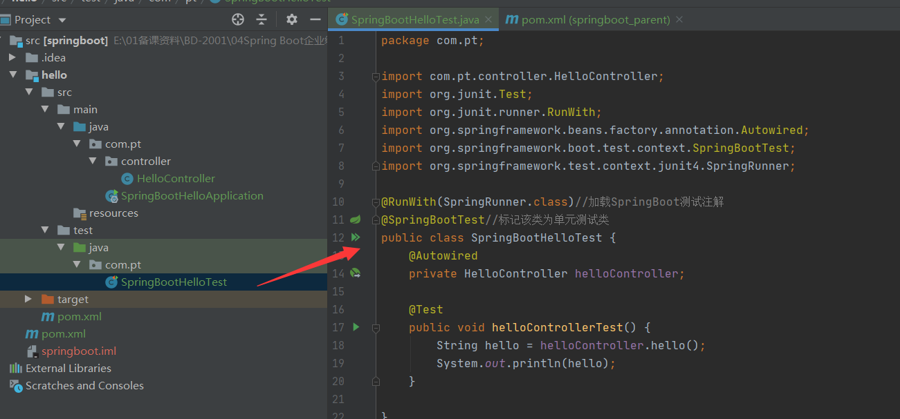

# 项目一、SpringBoot基础

## 任务一 Spring Boot开发入门

### 课程介绍

- Spring Boot概述（了解）
- 构建Spring Boot项目（重点）
- 单元测试（掌握）
- 热部署（掌握）
- Spring Boot 原理分析（理解）

### Spring Boot概述

​		早期版本的Spring专注于XML配置，开发一个程序需要配置各种XML配置文件。为了简化开发，在Spring 2.x版本开始引入少量的注解，由于支持的注解不是很多且功能尚不完善，所以只能辅助使用。
随着实际生产中敏捷开发的需要，以及Spring注解的大量出现和功能改进，到了Spring 4.x版本基本可以脱离XML配置文件进行项目开发，多数开发者也逐渐感受到了基于注解开发的便利，因此，在Spring中使用注解开发逐渐占据了主流地位。与此同时，Pivotal团队在原有Spring框架的基础上通过注解的方式进一步简化了Spring框架的使用，并基于Spring框架开发了全新的Spring Boot框架。

​		Spring Boot框架本身并不提供Spring框架的核心特性以及扩展功能，只是用于快速、敏捷地开发新一代基于Spring框架的应用，并且在开发过程中大量使用“**约定优先配置**”（convention over configuration）的思想来摆脱Spring框架中各种复杂的手动配置，同时衍生出了Java Config（取代传统XML配置文件的Java配置类）这种优秀的配置方式。也就是说，Spring Boot并不是替代Spring框架的解决方案，而是和Spring框架紧密结合用于提升Spring开发者体验的工具，同时Spring Boot还集成了大量常用的第三方库配置（例如Jackson、JDBC、Redis、Mail等）。使用Spring Boot开发程序时，几乎是开箱即用（out-of-the-box），大部分的Spring Boot应用都只需少量的配置，这一特性更能促使开发者专注于业务逻辑的实现。
​		另外，随着近几年微服务开发的需求和火爆，怎样快速、简便地构建一个准生产环境的Spring应用也是摆在开发者面前的一个难题，而Spring Boot框架的出现恰好完美的解决了这些问题，同时内部还简化了许多常用的第三方库配置，使得微服务开发更加便利。

### 使用Maven构建Spring Boot项目

#### 基础环境

​	需要提前安装好JDK1.8（及以上）版本 及 Maven。

#### Hello项目构建

1. 创建Maven基础项目

   

   

2. 在pom.xml中添加Spring Boot相关依赖

   ```xml
   <!-- 引入Spring Boot依赖 -->
   <parent>
   	<groupId>org.springframework.boot</groupId>
   	<artifactId>spring-boot-starter-parent</artifactId>
   	<version>2.1.3.RELEASE</version>
   </parent>
   <dependencies>
   	<!-- 引入Web场景依赖启动器 -->
   	<dependency>
   		<groupId>org.springframework.boot</groupId>
   		<artifactId>spring-boot-starter-web</artifactId>
   	</dependency>
   </dependencies>
   ```

   

3. 创建子Module

   

   

   此时就创建了子模块，子模块可以依赖父级项目的pom的配置，此时可以删除父级的src目录:

   

   删除之后如图所示：

   

4. 目录理解

   

5. 编写主程序启动类

   在hello模块的main下的java中编写启动类：

   

   ```java
   package com.pt;
   
   
   import org.springframework.boot.SpringApplication;
   import org.springframework.boot.autoconfigure.SpringBootApplication;
   
   @SpringBootApplication //标记该类为主程序启动类
   public class SpringBootHelloApplication {
       //主程序启动方法
       public static void main(String[] args) {
           SpringApplication.run(SpringBootHelloApplication.class, args);
       }
   }
   ```

6. 创建一个用于Web访问的Controller

   在com.pt包下创建对应的controller包，并创建对应的HelloController类：

   

7. 运行项目

   来到SpringBootHelloApplication主类下，右键或快捷键（ctrl+shift+f10）运行项目：

   

   正常运行后可以看到控制台信息：

   

8. 浏览器中访问（http://localhost:8080/hello）

   

#### 注意事项

​		注意梳理构建Spring Boot项目的流程和步骤，刚开始在做的过程中可能会遇到一些小问题，多做几次巩固即可；除此之外还有一种通过Spring Initializr方式构建类似可自学，建议掌握上面方式即可。

###  单元测试及热部署

#### 单元测试

##### 为什么学单元测试

​		单元测试是黑盒测试的基础，基本的准入测试，既能验证逻辑的准确性，又能给后续的接口重构提供基础，提升代码的健壮性和稳定性。

##### 单元测试是什么

​		单元测试是开发者编写的一小段代码，用于检验被测代码的一个很小的、很明确的功能是否正确。通常而言，一个单元测试是用于判断某个特定条件（或者场景）下某个特定函数的行为。

##### 单元测试哪里用

​		主要是开发人员在开发过程中对自己写的代码进行单元测试。

##### 实现过程

1. 在pom文件中添加spring-boot-starter-test测试启动器

   由于我们需要在多个子模块中用到单元测试，需要在父级的pom中加入对应的依赖：

   ```xml	
           <!--引入单元测试依赖-->
           <dependency>
               <groupId>org.springframework.boot</groupId>
               <artifactId>spring-boot-starter-test</artifactId>
               <scope>test</scope>
           </dependency>
           <dependency>
               <groupId>junit</groupId>
               <artifactId>junit</artifactId>
               <scope>test</scope>
           </dependency>
   ```

   

2. 编写单元测试类

   单元测试类需要写在test目录对应的java下：

   ```java
   package com.pt;
   
   import com.pt.controller.HelloController;
   import org.junit.Test;
   import org.junit.runner.RunWith;
   import org.springframework.beans.factory.annotation.Autowired;
   import org.springframework.boot.test.context.SpringBootTest;
   import org.springframework.test.context.junit4.SpringRunner;
   
   @RunWith(SpringRunner.class)//加载SpringBoot测试注解
   @SpringBootTest//标记该类为单元测试类
   public class SpringBootHelloTest {
    
   
   }
   ```

   

3. 编写单元测试方法

   ```java
   package com.pt;
   
   import com.pt.controller.HelloController;
   import org.junit.Test;
   import org.junit.runner.RunWith;
   import org.springframework.beans.factory.annotation.Autowired;
   import org.springframework.boot.test.context.SpringBootTest;
   import org.springframework.test.context.junit4.SpringRunner;
   
   @RunWith(SpringRunner.class)//加载SpringBoot测试注解
   @SpringBootTest//标记该类为单元测试类
   public class SpringBootHelloTest {
       @Autowired
       private HelloController helloController;
   
       @Test
       public void helloControllerTest() {
           String hello = helloController.hello();
           System.out.println(hello);
       }
   }
   ```

   

4. 运行结果

   选中对应的测试方法运行，运行之后如果一切正常并能返回预期数据，同时绿色表示通过。

   

   

#### 热部署

热部署主要是在代码更新后可以自动加载生效更新的代码，勿须手动重启服务，提升开发效率：

1. 在pom文件中添加spring-boot-devtools热部署依赖

   在外部的父级pom中引入依赖：

   ```xml
   <!--热部署对应的开发工具依赖-->
           <dependency>
               <groupId>org.springframework.boot</groupId>
               <artifactId>spring-boot-devtools</artifactId>
           </dependency>
   ```

2. IDEA中热部署设置

   IDEA左上角选择【File】→【Settings】选项，打开Compiler面板设置页:

   

   同时使用组合键“ctrl+shift+alt+/”调出Maintence选项框，并点击Registry项，勾选如图项：

   

   然后点击close，一定要重启IDEA才能生效。

3. 热部署测试

   修改返回结果代码测试。

### Spring Boot原理分析

#### 依赖管理

1. spring-boot-starter-parent依赖

   ```xml
   <!-- Spring Boot父项目依赖管理 -->
   <parent>
   	<groupId>org.springframework.boot</groupId>
   	<artifactId>spring-boot-starter-parent</artifactId>
   	<version>2.1.3.RELEASE</version>
   	<relativePath/>
   </parent>
   
   ```

   使用ctrl加左键可以追踪查看依赖，spring-boot-starter-parent是通过<properties>标签对一些常用技术框架的依赖文件进行了统一版本号管理。

2. spring-boot-starter-web依赖

   ```xml
           <!-- 引入Web场景依赖启动器 -->
           <dependency>
               <groupId>org.springframework.boot</groupId>
               <artifactId>spring-boot-starter-web</artifactId>
           </dependency>
   ```

   spring-boot-starter-web依赖启动器的主要作用是提供Web开发场景所需的底层所有依赖文件，它对Web开发场景所需的依赖文件进行了统一管理。

#### 自动配置

​		Spring Boot应用的启动入口是@SpringBootApplication注解标注类中的main()方法；

  1. @SpringBootApplication能够扫描Spring组件并自动配置Spring Boot;

  2. @SpringBootApplication注解是一个组合注解:

     包含@SpringBootConfiguration、@EnableAutoConfiguration、@ComponentScan三个核心注解。

#### 执行流程

1. 初始化Spring Application实例
2. 初始化Spring Boot 项目启动


### 总结

1. 创建SpringBoot项目的方式
   - **通过创建Maevn项目**
   - Spring.io官网初始化（自动）
   - Spring.io官网初始化（手动）
2. 单元测试
3. 热部署

### 作业

​		熟练完成Spring Boot项目构建；

​		配置好单元测试及热部署开发环境。

##  任务二 Spring Boot核心配置

### 知识回顾

1、SpringBoot：约定大于配置

2、3种方式：

- Maven（推荐）
- Idea+Spring Init（熟悉）
- Spring Init（不推荐）

3、单元测试

4、热部署

5、SpringBoot原理分析

### 课程介绍

- 全局配置文件（掌握）
- 属性值注入（**重点-掌握**）
- 自定义配置（理解）

### 全局配置文件

Spring Boot的全局配置文件一般使用application.properties或application.yaml，properties和yaml表示两种数据格式，通常都是用来做配置。存放路径： src/main/resource目录或者类路径的/config。

#### application.properties配置文件

任务描述：使用application.properties配置文件实现对对象的属性值注入：

1. 创建一个子模块

2. 编写主类

   ```java
   package com.pt;
   
   import org.springframework.boot.SpringApplication;
   import org.springframework.boot.autoconfigure.SpringBootApplication;
   
   @SpringBootApplication
   public class ConfigApplication {
       public static void main(String[] args) {
           SpringApplication.run(ConfigApplication.class, args);
       }
   }
   
   ```

3. 创建Pet类和Person类

   ```java
   package com.pt.domain;
   
   public class Pet {
       private String type;
       private String name;
   
       public String getType() {
           return type;
       }
   
       public void setType(String type) {
           this.type = type;
       }
   
       public String getName() {
           return name;
       }
   
       public void setName(String name) {
           this.name = name;
       }
   
       @Override
       public String toString() {
           return "Pet{" +
                   "type='" + type + '\'' +
                   ", name='" + name + '\'' +
                   '}';
       }
   }
   ```

   ```java
   package com.pt.domain;
   
   import org.springframework.boot.context.properties.ConfigurationProperties;
   import org.springframework.stereotype.Component;
   import java.util.*;
   
   @Component    // 用于将Person类作为Bean注入到Spring容器中
   @ConfigurationProperties(prefix = "person") // 将配置文件中以person开头的属性注入到该类中
   public class Person {
       private int id;            //id
       private String name;      //名称
       private List hobby;       //爱好
       private String[] family; //家庭成员
       private Map map;
       private Pet pet;          //宠物
   
       public int getId() {
           return id;
       }
   
       public void setId(int id) {
           this.id = id;
       }
   
       public String getName() {
           return name;
       }
   
       public void setName(String name) {
           this.name = name;
       }
   
       public List getHobby() {
           return hobby;
       }
   
       public void setHobby(List hobby) {
           this.hobby = hobby;
       }
   
       public String[] getFamily() {
           return family;
       }
   
       public void setFamily(String[] family) {
           this.family = family;
       }
   
       public Map getMap() {
           return map;
       }
   
       public void setMap(Map map) {
           this.map = map;
       }
   
       public Pet getPet() {
           return pet;
       }
   
       public void setPet(Pet pet) {
           this.pet = pet;
       }
   
       @Override
       public String toString() {
           return "Person{" +
                   "id=" + id +
                   ", name='" + name + '\'' +
                   ", hobby=" + hobby +
                   ", family=" + Arrays.toString(family) +
                   ", map=" + map +
                   ", pet=" + pet +
                   '}';
       }
   }
   
   ```

4. 准备对应的配置文件

   在main/resources下准备application.properties配置文件：

   ```pr
   person.id=1
   person.name=tom
   person.hobby=play,read,sleep
   person.family=father,mother
   person.map.k1=v1
   person.map.k2=v2
   person.pet.type=dog
   person.pet.name=kity
   ```

   

   如果希望在配置过程中有提示需要加入以下依赖：

   ```xml
   <!--配置处理器依赖-->
   <dependency>
       <groupId>org.springframework.boot</groupId>
       <artifactId>spring-boot-configuration-processor</artifactId>
       <optional>true</optional>
   </dependency>
   ```

   然后Ctrl+F9重新编译项目即可提示，方便我们配置。

5. 单元测试

   编写单元测试类检验是否可以注入属性值。

   ```java
   package com.pt.config;
   
   
   import com.pt.domain.Person;
   import org.junit.Test;
   import org.junit.runner.RunWith;
   import org.springframework.beans.factory.annotation.Autowired;
   import org.springframework.boot.test.context.SpringBootTest;
   import org.springframework.test.context.junit4.SpringRunner;
   
   @RunWith(SpringRunner.class)
   @SpringBootTest
   public class PersonConfigTest {
       @Autowired
       private Person person;
   
       @Test
       public void findPerson() {
           System.out.println(person);
       }
   }
   ```

   运行单元测试类：

   

#### application.yaml配置文件

​		如果使用YAML格式完成上面案例，只需要修改配置文件即可。YAML文件格式是Spring Boot支持的一种JSON超集文件格式。相较于传统的Properties配置文件，YAML文件以数据为核心，是一种更为直观且容易被电脑识别的数据序列化格式。application.yaml文件的工作原理和application.properties一样。

1. 语法格式

   **key:（空格）value**

   ```yam
   server:
       port: 8081
       path: /hello
   ```

   YAML文件中的value值类型不同，写法不同。

   - value的值为普通数据类型

   ```yaml
   server:
   port: 8081
   path: /hello
   ```

   - value的值为数组和单列集合

   ```yaml
   person:
     hobby: [play,read,sleep]
   
   或
   
   person:
     hobby:
       - play
       - read
       - sleep 
   
   ```

   - value的值为Map集合或对象

   ```yaml
   person:
     map:
       k1: v1
       k2: v2
   
   或
   
   person:
       map: {k1: v1,k2: v2}
   ```

2. 使用yaml完成上面案例的配置

   ```yaml
   person:
     id: 2
     name: 张三
     hobby: [sing,read,sleep]
     family: [father,mother]
     map: {k1: v1,k2: v2}
     pet: {type: cat, name: tom}
   ```

3. 运行单元测试（运行之前需要将原来的application.properties修改成其他名字，如application.properties.bak）

   

### 配置文件属性值的注入

#### @ConfigurationProperties

​		使用@ConfigurationProperties注入属性，需要用到@Component和@ConfigurationProperties(prefix = “xxx”)两个注解。

```java
@Component
@ConfigurationProperties(prefix = "person")
public class Person {
    private int id;      
    public void setId(int id) {
        this.id = id;
    }
}
```

注意：使用@ConfigurationProperties注解批量注入属性值时，要保证配置文件中的属性与对应实体类的属性一致，否则无法正确获取并注入属性值。

#### 使用@Value注入属性

​		@Value是Spring提供的，使用@Value注入属性，主要使用@Component和@Value实现属性值注入。

```java
@Component
public class Person {
	@Value("${person.id}")
    private int id;      
}

```

使用@Value注解对每一个属性注入设置，免去了属性setXX()方法。

#### 两种注解对比分析

| **对比点**       | **@ConfigurationProperties** | **@Value** |
| ---------------- | ---------------------------- | ---------- |
| 底层框架         | Spring Boot                  | Spring     |
| 功能             | 批量注入配置文件中的属性     | 单个注入   |
| 属性setXX()方法  | 需要                         | 不需要     |
| 复杂类型属性注入 | 支持                         | 不支持     |
| 松散绑定         | 支持                         | 不支持     |
| JSR303数据校验   | 支持                         | 不支持     |
| SpEL表达式       | 不支持                       | 支持       |

### SpringBoot自定义配置

Spring Boot免除了项目中大部分的手动配置，对于一些特定情况，我们可以通过修改全局配置文件以适应具体生产环境，可以说，几乎所有的配置都可以写在application.peroperties文件中，Spring Boot会自动加载全局配置文件从而免除我们手动加载的烦恼。但是，如果我们自定义配置文件，Spring Boot是无法识别这些配置文件的，此时就需要我们手动加载。

#### @PropertySource加载配置

@ PropertySource：指定自定义配置文件的位置和名称

@ Configuration ：自定义配置类，Spring容器组件
1、在项目的类路径下新建一个my.properties自定义配置文件，在该配置文件中编写需要设置的配置属性。

```pro
#对实体类对象UserProperties进行属性配置
user.id=110
user.name=test
```

2、新创建一个配置类UserProperties，提供my.properties自定义配置文件中对应的属性，并根据@PropertySource注解的使用进行相关配置。

```java
package com.pt.domain;

import org.springframework.boot.context.properties.ConfigurationProperties;
import org.springframework.boot.context.properties.EnableConfigurationProperties;
import org.springframework.context.annotation.Configuration;
import org.springframework.context.annotation.PropertySource;

@Configuration    // 自定义配置类
@EnableConfigurationProperties(UserProperties.class) // 开启对应配置类的属性注入功能
@PropertySource("classpath:my.properties")   // 指定自定义配置文件位置和名称
@ConfigurationProperties(prefix = "user")      // 指定配置文件注入属性前缀
public class UserProperties {
    private int id;
    private String name;

    public int getId() {
        return id;
    }

    public void setId(int id) {
        this.id = id;
    }

    public String getName() {
        return name;
    }

    public void setName(String name) {
        this.name = name;
    }

    @Override
    public String toString() {
        return "User{" +
                "id=" + id +
                ", name='" + name + '\'' +
                '}';
    }
}

```

3、在测试类中引入User实体类Bean对象，并新增一个测试方法进行输出测试。

```java
package com.pt.config;


import com.pt.domain.UserProperties;
import org.junit.Test;
import org.junit.runner.RunWith;
import org.springframework.beans.factory.annotation.Autowired;
import org.springframework.boot.test.context.SpringBootTest;
import org.springframework.test.context.junit4.SpringRunner;


@RunWith(SpringRunner.class)
@SpringBootTest
public class UserPropertiesConfigTest {
    @Autowired
    private UserProperties userProperties;

    @Test
    public void findStudent() {
        System.out.println(userProperties);
    }
}
```

4、测试结果


#### @ImportResource加载XML配置

用@ ImportResource：指定XML文件位置。

1、在项目下新建一个com.pt.service包，并在该包下新创建一个类UserService，该类中不需要编写任何代码。

```java
package com.pt.service;


public class UserService {
}

```

2、在resources目录下新建一个名为beans.xml的XML自定义配置文件，在该配置文件中通过配置向Spring容器中添加UserService类对象。

```xml
<?xml version="1.0" encoding="UTF-8"?>
<beans xmlns="http://www.springframework.org/schema/beans"
       xmlns:xsi="http://www.w3.org/2001/XMLSchema-instance"
       xsi:schemaLocation="http://www.springframework.org/schema/beans
                      http://www.springframework.org/schema/beans/spring-beans.xsd">
    <bean id="myService" class="com.pt.service.UserService" />
</beans>
```

3、项目启动类上添加@ImportResource注解来指定XML文件位置。

```java
package com.pt;

import org.springframework.boot.SpringApplication;
import org.springframework.boot.autoconfigure.SpringBootApplication;
import org.springframework.context.annotation.ImportResource;

@SpringBootApplication
@ImportResource("classpath:beans.xml")
public class ConfigApplication {
    public static void main(String[] args) {
        SpringApplication.run(ConfigApplication.class, args);
    }
}
```


4、在测试类中引入ApplicationContext实体类Bean，并新增一个测试方法进行输出测试。

```java
package com.pt.config;


import com.pt.domain.UserProperties;
import org.junit.Test;
import org.junit.runner.RunWith;
import org.springframework.beans.factory.annotation.Autowired;
import org.springframework.boot.test.context.SpringBootTest;
import org.springframework.context.ApplicationContext;
import org.springframework.test.context.junit4.SpringRunner;


@RunWith(SpringRunner.class)
@SpringBootTest
public class UserPropertiesConfigTest {
    @Autowired
    private UserProperties userProperties;

    @Test
    public void findStudent() {
        System.out.println(userProperties);
    }

    @Autowired
    private ApplicationContext applicationContext;

    @Test
    public void iocTest() {
        System.out.println(applicationContext.containsBean("myService"));
    }

}
```

5、测试结果如图所示。


####  @Configuration编写自定义配置类

使用XML配置来注入对象只有在特殊情况下才会用到，在SpringBoot中的原则是“约定大于配置”，推荐使用配置类的方式代替XML。在上面的例子基础上演示：

1、新建一个类com.pt.config.UserConfig，使用@Configuration注解将该类声明一个配置类。

```java
package com.pt.config;

import com.pt.service.UserService;
import org.springframework.context.annotation.Bean;
import org.springframework.context.annotation.Configuration;

@Configuration //定义该类是一个配置类
public class UserConfig {
    @Bean //将返回值对象作为组件添加到SPRING容器中，默认id为方法名称
    public UserService userService() {
        return new UserService();
    }
}

```

2、在项目启动类上添加的@ImportResource注解注释

```java
import org.springframework.context.annotation.ImportResource;

@SpringBootApplication
@ImportResource
public class ConfigApplication {
    public static void main(String[] args) {
        SpringApplication.run(ConfigApplication.class, args);
    }
}
```

3、测试


### 总结

1. 配置文件

   - application.properties
   - application.yaml

   application.properties优先级高于application.yaml，推荐使用application.yaml

   application.properties会出现中文乱码，而yaml不会

   2个配置文件可以共存

   名字不能改变

### 作业

1、 完成全局配置文件的使用；

2、 完成配置文件属性的注入；

3、完成自定义配置的使用。

## 任务三  Spring Boot多环境配置

### 知识回顾

### 课程介绍

-  Spring Boot多环境配置应用场景（理解）
-  Spring Boot多环境配置实现（**重点-掌握**）

### 应用场景

在实际开发中，应用程序通常需要部署到不同的运行环境中，例如开发环境、测试环境、生产环境等。不同的环境可能需要不同的环境配置，针对这种情况，不可能手动变更配置文件来适应不同的开发环境，通常需要对项目进行多环境配置，Spring Boot框架提供了两种多环境配置的方式，分别是Profile文件多环境配置和@Profile注解多环境配置。

### 使用@Profile文件进行多环境配置

1、多环境配置文件格式

application-{profile}.properties

```tex
application-dev.properties //开发环境
application-test.properties	//测试环境
application-prod.properties	//生产环境
```

2、新建3个以上配置文件，分别定义不同的端口

application-dev.properties //开发环境

```pro
server.port=8081
```

application-test.properties	//测试环境

```
server.port=8082
```

application-prod.properties	//生产环境

```pro
server.port=8083
```

3、在application.yaml中声明用哪种方式进行测试

```yam
spring:
  profiles:
    active: test
```

4、测试结果


### 使用@Profile注解进行多环境配置

#### 场景描述

在项目开发过程中对应的数据库通常对应的有开发、测试、生产环境，当我们连接数据库时需要连接不同的数据库，此时需要多环境配置。

1、新建一个数据库配置接口

```java
package com.pt.config;

public interface DBConnector {
    public void configure();
}
```

2、分别用三种方式实现数据库配置接口，并用@Profile注解该类

```java
package com.pt.config;


import org.springframework.context.annotation.Configuration;
import org.springframework.context.annotation.Profile;

@Configuration
@Profile("dev")    // 指定多环境配置类标识
public class DevDBConnector implements DBConnector {
    @Override
    public void configure() {
        System.out.println("数据库配置环境dev");
    }
}
```

```java
package com.pt.config;

import org.springframework.context.annotation.Configuration;
import org.springframework.context.annotation.Profile;


@Configuration
@Profile("prod")    // 指定多环境配置类标识
public class ProdDBConnector implements DBConnector {
    @Override
    public void configure() {
        System.out.println("数据库配置环境prod");
    }
}
```

```java
package com.pt.config;

import org.springframework.context.annotation.Configuration;
import org.springframework.context.annotation.Profile;

@Configuration
@Profile("test")    // 指定多环境配置类标识
public class TestDBConnector implements DBConnector {
    @Override
    public void configure() {
        System.out.println("数据库配置环境test");
    }
}
```


3、编写测试文件

```java
package com.pt.config;

import org.junit.Test;
import org.junit.runner.RunWith;
import org.springframework.beans.factory.annotation.Autowired;
import org.springframework.boot.test.context.SpringBootTest;
import org.springframework.test.context.junit4.SpringRunner;

@RunWith(SpringRunner.class)
@SpringBootTest
public class DBContollerTest {
    @Autowired
    private DBConnector dbConnector;

    @Test
    public void findDB() {
        dbConnector.configure();
    }
}

```


### 总结

1. 配置文件
   - 

### 作业

1、理解多环境配置的应用场景和必要性；

2、完成多环境配置的应用实验。

# 项目二、Spring Boot集成

## 任务一 Spring Boot整合Mybatis

### 知识回顾

### 课程介绍

-  Spring Boot整合Mybatis（**重点-掌握**）

### 整合Mybatis

在开发中，通常会涉及到对数据库的数据进行操作，Spring Boot在简化项目开发以及实现自动化配置的基础上，对关系型数据库和非关系型数据库的访问操作都提供了非常好的整合支持。

#### 准备数据

创建数据库、数据表并插入一定的数据：

```sql
CREATE TABLE `t_article` (
  `id` int(20) NOT NULL AUTO_INCREMENT COMMENT '文章id',
  `title` varchar(200) DEFAULT NULL COMMENT '文章标题',
  `content` longtext COMMENT '文章内容',
  PRIMARY KEY (`id`)
) ENGINE=InnoDB AUTO_INCREMENT=2 DEFAULT CHARSET=utf8;

INSERT INTO `t_article` VALUES ('1', 'Spring Boot基础入门', '从入门到精通讲解...');
INSERT INTO `t_article` VALUES ('2', 'Spring Cloud基础入门', '从入门到精通讲解...');

CREATE TABLE `t_comment` (
  `id` int(20) NOT NULL AUTO_INCREMENT COMMENT '评论id',
  `content` longtext COMMENT '评论内容',
  `author` varchar(200) DEFAULT NULL COMMENT '评论作者',
  `a_id` int(20) DEFAULT NULL COMMENT '关联的文章id',
  PRIMARY KEY (`id`)
) ENGINE=InnoDB AUTO_INCREMENT=3 DEFAULT CHARSET=utf8;


INSERT INTO `t_comment` VALUES ('1', '很全、很详细', '狂奔的蜗牛', '1');
INSERT INTO `t_comment` VALUES ('2', '赞一个', 'tom', '1');
INSERT INTO `t_comment` VALUES ('3', '很详细', 'kitty', '1');
INSERT INTO `t_comment` VALUES ('4', '很好，非常详细', '张三', '1');
INSERT INTO `t_comment` VALUES ('5', '很不错', '张杨', '2');
```

#### 创建项目


引入Mybatis和Mysql对应的依赖：

```xml
        <!-- 阿里巴巴的Druid数据源依赖启动器 -->
        <dependency>
            <groupId>com.alibaba</groupId>
            <artifactId>druid-spring-boot-starter</artifactId>
            <version>1.1.10</version>
        </dependency>

        <!-- MyBatis依赖启动器 -->
        <dependency>
            <groupId>org.mybatis.spring.boot</groupId>
            <artifactId>mybatis-spring-boot-starter</artifactId>
            <version>2.0.0</version>
        </dependency>
        <!-- MySQL数据库连接驱动 -->
        <dependency>
            <groupId>mysql</groupId>
            <artifactId>mysql-connector-java</artifactId>
            <scope>runtime</scope>
        </dependency>
```

#### 实体类

Article.java

```java
package com.pt.domain;


import java.util.List;

public class Article {
    private Integer id;
    private String title;
    private String content;
    private List<Comment> commentList;

    public Integer getId() {
        return id;
    }

    public void setId(Integer id) {
        this.id = id;
    }

    public String getTitle() {
        return title;
    }

    public void setTitle(String title) {
        this.title = title;
    }

    public String getContent() {
        return content;
    }

    public void setContent(String content) {
        this.content = content;
    }

    public List<Comment> getCommentList() {
        return commentList;
    }

    public void setCommentList(List<Comment> commentList) {
        this.commentList = commentList;
    }

    @Override
    public String toString() {
        return "Article{" +
                "id=" + id +
                ", title='" + title + '\'' +
                ", content='" + content + '\'' +
                ", commentList=" + commentList +
                '}';
    }
}
```

Comment.java

```java
package com.pt.domain;


public class Comment {
    private Integer id;
    private String content;
    private String author;
    private Integer aId;

    public Integer getId() {
        return id;
    }

    public void setId(Integer id) {
        this.id = id;
    }

    public String getContent() {
        return content;
    }

    public void setContent(String content) {
        this.content = content;
    }

    public String getAuthor() {
        return author;
    }

    public void setAuthor(String author) {
        this.author = author;
    }

    public Integer getaId() {
        return aId;
    }

    public void setaId(Integer aId) {
        this.aId = aId;
    }

    @Override
    public String toString() {
        return "Comment{" +
                "id=" + id +
                ", content='" + content + '\'' +
                ", author='" + author + '\'' +
                ", aId=" + aId +
                '}';
    }
}
```

#### 编写配置文件

在类路径resources下新建application.properties文件，配置对应的数据库信息：

```pro
spring.datasource.url=jdbc:mysql://localhost:3306/springbootdata?serverTimezone=UTC
spring.datasource.username=root
spring.datasource.password=root
```

设置数据源类型配置（以阿里巴巴的Druid数据源为例）:

```pro
spring.datasource.type = com.alibaba.druid.pool.DruidDataSource
spring.datasource.initialSize=20
spring.datasource.minIdle=10
spring.datasource.maxActive=100
```

#### 数据源配置类

需要将DruidDataSource编写配置类注入到Spring容器中：

```java
package com.pt.config;

import com.alibaba.druid.pool.DruidDataSource;
import org.springframework.boot.context.properties.ConfigurationProperties;
import org.springframework.context.annotation.Bean;
import org.springframework.context.annotation.Configuration;

import javax.sql.DataSource;

@Configuration
public class DataSourceConfig {
    @Bean
    @ConfigurationProperties(prefix = "spring.datasource")
    public DataSource getDruid() {
        return new DruidDataSource();
    }
}

```

#### 创建启动类

```java
package com.pt;

import org.springframework.boot.SpringApplication;
import org.springframework.boot.autoconfigure.SpringBootApplication;

@SpringBootApplication //标记该类为主程序启动类
public class MybatisPluginApplication {
    public static void main(String[] args) {
        SpringApplication.run(MybatisPluginApplication.class, args);
    }
}

```

#### 使用注解整合

1、创建Mapper接口文件

```java
package com.pt.mapper;


import com.pt.domain.Comment;
import org.apache.ibatis.annotations.*;

@Mapper
public interface CommentMapper {
    @Select("SELECT * FROM t_comment WHERE id =#{id}")
    public Comment findById(Integer id);

    @Insert("INSERT INTO t_comment(content,author,a_id) " +
            "values (#{content},#{author},#{aId})")
    public int insertComment(Comment comment);

    @Update("UPDATE t_comment SET content=#{content} WHERE id=#{id}")
    public int updateComment(Comment comment);

    @Delete("DELETE FROM t_comment WHERE id=#{id}")
    public int deleteComment(Integer id);

}
```

2、编写单元测试

```java
package com.pt.mapper;


import com.pt.domain.Article;
import com.pt.domain.Comment;
import org.junit.Test;
import org.junit.runner.RunWith;
import org.springframework.beans.factory.annotation.Autowired;
import org.springframework.boot.test.context.SpringBootTest;
import org.springframework.test.context.junit4.SpringRunner;

@RunWith(SpringRunner.class)
@SpringBootTest
public class CommentMapperTest {
    @Autowired
    private CommentMapper commentMapper;

    @Test
    public void selectComment() {
        Comment comment = commentMapper.findById(1);
        System.out.println(comment);
    }
}

```

3、整合测试


注意aId未取到值，没有映射成功，由于数据库字段a_id使用了驼峰形式无法正确映射，需要在配置文件中开启驼峰映射：

```pro
mybatis.configuration.map-underscore-to-camel-case=true
```

然后进行单元测试即可。

#### 使用配置文件整合

整合Mybatis除了使用注解整合，依然可以使用配置文件进行整合：

1、创建Mapper接口文件

```java
package com.pt.mapper;


import com.pt.domain.Article;
import org.apache.ibatis.annotations.Mapper;

@Mapper
public interface ArticleMapper {
    public Article selectArticle(Integer id);

    public int updateArticle(Article article);

}
```

2、创建xml映射文件

在resources下创建mapper包，并将对应的配置文件（ArticleMapper.xml）放在mapper中

```xml
<?xml version="1.0" encoding="UTF-8" ?>
<!DOCTYPE mapper
        PUBLIC "-//mybatis.org//DTD Mapper 3.0//EN"
        "http://mybatis.org/dtd/mybatis-3-mapper.dtd">
<mapper namespace="com.pt.mapper.ArticleMapper">
    <!-- 1、查询文章详细（包括评论信息） -->
    <select id="selectArticle" resultMap="articleWithComment">
       SELECT a.*,c.id c_id,c.content c_content,c.author
       FROM t_article a,t_comment c
       WHERE a.id=c.a_id AND a.id = #{id}
    </select>
    <resultMap id="articleWithComment" type="Article">
        <id property="id" column="id" />
        <result property="title" column="title" />
        <result property="content" column="content" />
        <collection property="commentList" ofType="Comment">
            <id property="id" column="c_id" />
            <result property="content" column="c_content" />
            <result property="author" column="author" />
        </collection>
    </resultMap>

    <!-- 2、根据文章id更新文章信息 -->
    <update id="updateArticle" parameterType="Article" >
        UPDATE t_article
        <set>
            <if test="title !=null and title !=''">
                title=#{title},
            </if>
            <if test="content !=null and content !=''">
                content=#{content}
            </if>
        </set>
        WHERE id=#{id}
    </update>
</mapper>
```

3、在application.properties中配置xml文件映射路径

```pro
#mybatis配置文件加载路径
mybatis.mapper-locations=classpath:mapper/*.xml
#实体类对应的路径
mybatis.type-aliases-package=com.pt.domain
```

4、编写单元测试方法

```java
    @Autowired
    private ArticleMapper articleMapper;

    @Test
    public void selectArticle() {
        System.out.println(articleMapper.selectArticle(1));
    }
```

5、测试


### 总结

### 作业

完成SpringBoot和Mybatis的集成。

----------------------------------------------------------------

## 任务二 Spring Boot整合JPA

### 知识回顾

### 课程介绍

-  Spring Data JPA介绍（理解）
-  Spring Boot整合JPA（**重点-掌握**）

###  Spring Data JPA介绍

Spring Data JPA是Spring基于ORM框架、JPA规范的基础上封装的一套JPA应用框架，它提供了增删改查等常用功能，使开发者可以用较少的代码实现数据操作，同时还易于扩展。

#### Spring Data JPA基本使用

1、编写ORM实体类：实体类与数据表进行映射，并且配置好映射关系。

```java
@Entity(name = "t_comment")
public class Discuss {
    @Id    
    @GeneratedValue(strategy =GenerationType.IDENTITY)
    private Integer id;
    @Column(name = "a_id")
    private Integer aId;
	// 省略getXX()和setXX()方法
}

```

2、编写Repository接口：针对不同的表数据操作编写各自对应的Repositor接口，并根据需要编写对应的数据操作方法。

### Spring Boot整合JPA

1、在pom文件中添加Spring Data JPA依赖启动器

```xml
<dependency>
	<groupId>org.springframework.boot</groupId>
	<artifactId>spring-boot-starter-data-jpa</artifactId>
</dependency>

```

2、编写ORM实体类

```JAVA
package com.pt.domain;

import javax.persistence.*;

@Entity(name = "t_comment")  // 设置ORM实体类，并指定映射的表名
public class Discuss {
    @Id   // 表明映射对应的主键id
    @GeneratedValue(strategy = GenerationType.IDENTITY) // 设置主键自增策略
    private Integer id;
    private String content;
    private String author;
    @Column(name = "a_id")  //指定映射的表字段名
    private Integer aId;

    public Integer getId() {
        return id;
    }

    public void setId(Integer id) {
        this.id = id;
    }

    public String getContent() {
        return content;
    }

    public void setContent(String content) {
        this.content = content;
    }

    public String getAuthor() {
        return author;
    }

    public void setAuthor(String author) {
        this.author = author;
    }

    public Integer getaId() {
        return aId;
    }

    public void setaId(Integer aId) {
        this.aId = aId;
    }

    @Override
    public String toString() {
        return "Discuss{" +
                "id=" + id +
                ", content='" + content + '\'' +
                ", author='" + author + '\'' +
                ", aId=" + aId +
                '}';
    }
}

```

3、编写Repository接口

```JAVA
package com.pt.repository;

import com.pt.domain.Discuss;
import org.springframework.data.domain.Pageable;
import org.springframework.data.jpa.repository.JpaRepository;
import org.springframework.data.jpa.repository.Modifying;
import org.springframework.data.jpa.repository.Query;

import javax.transaction.Transactional;
import java.util.List;

public interface DiscussRepository extends JpaRepository<Discuss, Integer> {
    // 1、查询author非空的Discuss评论集合
    public List<Discuss> findByAuthorNotNull();

    // 2、根据文章id分页查询Discuss评论集合
    @Query("SELECT c FROM t_comment c WHERE  c.aId = ?1")
    public List<Discuss> getDiscussPaged(Integer aid, Pageable pageable);

    // 3、使用元素SQL语句，根据文章id分页查询Discuss评论集合
    @Query(value = "SELECT * FROM t_comment  WHERE  a_Id = ?1", nativeQuery = true)
    public List<Discuss> getDiscussPaged2(Integer aid, Pageable pageable);

    //4、 根据评论id修改评论作者author
    @Transactional
    @Modifying
    @Query("UPDATE t_comment c SET c.author = ?1 WHERE  c.id = ?2")
    public int updateDiscuss(String author, Integer id);

    // 5、根据评论id删除评论
    @Transactional
    @Modifying
    @Query("DELETE from t_comment c WHERE  c.id = ?1")
    public int deleteDiscuss(Integer id);

}
```

4、编写单元测试进行接口方法测试

```JAVA
package com.pt.jpa;


import com.pt.domain.Discuss;
import com.pt.repository.DiscussRepository;
import org.junit.Test;
import org.junit.runner.RunWith;
import org.springframework.beans.factory.annotation.Autowired;
import org.springframework.boot.test.context.SpringBootTest;
import org.springframework.data.domain.Example;
import org.springframework.data.domain.ExampleMatcher;
import org.springframework.data.domain.PageRequest;
import org.springframework.data.domain.Pageable;
import org.springframework.test.context.junit4.SpringRunner;

import java.util.List;
import java.util.Optional;

@RunWith(SpringRunner.class)
@SpringBootTest
public class JPATest {
    @Autowired
    private DiscussRepository repository;

    // 1、使用JpaRepository内部方法进行数据操作
    @Test
    public void selectComment() {
        Optional<Discuss> optional = repository.findById(1);
        if (optional.isPresent()) {
            System.out.println(optional.get());
        }
        System.out.println();
    }

    // 2、使用方法名关键字进行数据操作
    @Test
    public void selectCommentByKeys() {
        List<Discuss> list = repository.findByAuthorNotNull();
        System.out.println(list);
    }

    // 3、使用@Query注解进行数据操作
    @Test
    public void selectCommentPaged() {
        Pageable pageable = PageRequest.of(0, 3);
        List<Discuss> allPaged = repository.getDiscussPaged(1, pageable);
        System.out.println(allPaged);
    }


}
```

5、整合测试


### 总结

### 作业

1、掌握Spring Boot整合JPA的基本步骤

2、熟练运用Spring Boot和JPA完成数据的基本操作

----------------

## 任务三 Spring Boot视图技术

### 知识回顾

### 课程介绍

-  Spring Boot支持的视图技术介绍（理解）
-  Spring Boot整合Thymeleaf技术（**重点-掌握**）

###  Spring Boot支持的视图技术介绍

Spring Boot框架为简化项目的整体开发，对一些常用的视图技术实现了整合支持，并主要推荐整合模板引擎技术来实现前端页面的动态化内容。

#### 常用模板引擎

1. FreeMarker
2.  Groory
3. Thymeleaf

4. Mustache

#### 常用标签

| **th**:标签 | **说明**                               |
| ----------- | -------------------------------------- |
| th:insert   | 页面片段包含（类似JSP中的include标签） |
| th:replace  | 页面片段包含（类似JSP中的include标签） |
| th:each     | 元素遍历（类似JSP中的c:forEach标签）   |
| th:if       | 条件判断，如果为真                     |
| th:unless   | 条件判断，如果为假                     |
| th:switch   | 条件判断，进行选择性匹配               |
| th:case     | 条件判断，进行选择性匹配               |
| th:object   | 变量声明                               |
| th:with     | 变量声明                               |

| th:attr        | 通用属性修改                                 |
| -------------- | -------------------------------------------- |
| th:attrprepend | 通用属性修改，将计算结果追加前缀到现有属性值 |
| th:attrappend  | 通用属性修改，将计算结果追加后缀到现有属性值 |
| th:value       | 属性值修改，指定标签属性值                   |
| th:href        | 用于设定链接地址                             |
| th:src         | 用于设定链接地址                             |
| th:text        | 用于指定标签显示的文本内容                   |
| th:utext       | 用于指定标签显示的文本内容，对特殊标签不转义 |
| th:fragment    | 声明片段                                     |
| th:remove      | 移除片段                                     |

#### 主要语法

| **说明**       | **表达式语法** |
| -------------- | -------------- |
| 变量表达式     | ${...}         |
| 选择变量表达式 | *{...}         |
| 消息表达式     | #{...}         |
| 链接URL表达式  | @{...}         |
| 片段表达式     | ~{...}         |

#### 内置对象

#ctx：上下文对象
#vars：上下文变量
#locale：上下文区域设置
#request：（仅限Web Context）HttpServletRequest对象
#response：（仅限Web Context）HttpServletResponse对象
#session：（仅限Web Context）HttpSession对象
#servletContext：（仅限Web Context）ServletContext对象

#### 静态资源路径

Spring Boot默认将/**所有访问映射到以下目录：

classpath：/META-INF/resources/：项目类路径下的META-INF文件夹下 的resources文件夹下的所有文件。
classpath：/resources/：项目类路径下的resources文件夹下的所有文件。
classpath：/static/：项目类路径下的static文件夹下的所有文件
classpath：/public/：项目类路径下的public文件夹下的所有文件。

### Spring Boot整合Thymeleaf技术

1、添加依赖

```xml
<dependency>
   <groupId>org.springframework.boot</groupId>
   <artifactId>spring-boot-starter-thymeleaf</artifactId>
</dependency>
```

2、 thymeleaf页面缓存设置（默认为true），开发中方便调试应设置为false，上线稳定后应保持默认true

```pro
spring.thymeleaf.cache=false
```

3、创建控制类

创建一个用于前端模板页面动态数据替换效果测试的访问实体类LoginController。

```java
@Controller
public class LoginController {
    @GetMapping("/toLoginPage")
    public String toLoginPage(Model model){
        model.addAttribute("currentYear", Calendar.getInstance().get(Calendar.YEAR));
        return "login";
    }
}

```

4、创建模板页面并引入静态资源文件

创建一个用户登录的模板页面login.html,部分参考代码如下：

```html
<html lang="en" xmlns:th="http://www.thymeleaf.org">
<head>
    <meta http-equiv="Content-Type" content="text/html; charset=UTF-8">
    <meta name="viewport" content="width=device-width, initial-scale=1,
                                                                 shrink-to-fit=no">
    <title>用户登录界面</title>
    <link th:href="@{/login/css/bootstrap.min.css}" rel="stylesheet">
    <link th:href="@{/login/css/signin.css}" rel="stylesheet">
</head>

<body class="text-center">
<!--  用户登录form表单 -->
<form class="form-signin">
    
    <h1 class="h3 mb-3 font-weight-normal" >请登录</h1>
    <input type="text" class="form-control" required="" autofocus="">
    <input type="password" class="form-control"  required="">
    <div class="checkbox mb-3">
        <label>
            <input type="checkbox" value="remember-me">记住我
        </label>
    </div>
    <button class="btn btn-lg btn-primary btn-block" type="submit" >登录</button>
    <p class="mt-5 mb-3 text-muted">© <span th:text="${currentYear}">2018</span>-<span
            th:text="${currentYear}+1">2019</span></p>
</form>
</body>
</html>
```

5、目录结构


6、启动测试

http://localhost:8080/toLoginPage


### 国际化配置（扩展）

idea中默认properties文件字符集为GBK，需要改为UTF-8：


1、编写多语言国际化文件以及配置文件(在resources下新建i18n文件夹，创建以下配置文件)

login.properties

```pro
login.tip=请登录
login.username=用户名
login.password=密码
login.rememberme=记住我
login.button=登录
```

login_zh_CN.properties

```properties
login.tip=请登录
login.username=用户名
login.password=密码
login.rememberme=记住我
login.button=登录
```

login_en_US.properties

```properties
login.tip=Please sign in
login.username=Username
login.password=Password
login.rememberme=Remember me
login.button=Login
```

2、编写配置文件

打开项目的application.properties全局配置文件，在该文件中添加国际化文件基础名设置:

```properties
# thymeleaf页面缓存设置（默认为true），开发中方便调试应设置为false，上线稳定后应保持默认true
spring.thymeleaf.cache=false
# 配置国际化文件基础名
spring.messages.basename=i18n.login
```

3、定制区域信息解析器

创建一个用于定制国际化功能区域信息解析器的自定义配置类MyLocalResovel，MyLocalResolver自定义区域解析器配置类实现了LocaleResolver接口，并重写了其中的resolveLocale()方法进行自定义语言解析，最后使用@Bean注解将当前配置类注册成Spring容器中的一个类型为LocaleResolver的Bean组件，这样就可以覆盖默认的LocaleResolver组件。

```java
package com.pt.config;

import org.springframework.context.annotation.Bean;
import org.springframework.context.annotation.Configuration;
import org.springframework.lang.Nullable;
import org.springframework.util.StringUtils;
import org.springframework.web.servlet.LocaleResolver;

import javax.servlet.http.HttpServletRequest;
import javax.servlet.http.HttpServletResponse;
import java.util.Locale;


@Configuration
public class MyLocalResovel implements LocaleResolver {
    // 自定义区域解析方式
    @Override
    public Locale resolveLocale(HttpServletRequest httpServletRequest) {
        // 获取页面手动切换传递的语言参数l
        String l = httpServletRequest.getParameter("l");
        // 获取请求头自动传递的语言参数Accept-Language
        String header = httpServletRequest.getHeader("Accept-Language");
        Locale locale = null;
        // 如果手动切换参数不为空，就根据手动参数进行语言切换，否则默认根据请求头信息切换
        if (!StringUtils.isEmpty(l)) {
            String[] split = l.split("_");
            locale = new Locale(split[0], split[1]);
        } else {
            // Accept-Language: en-US,en;q=0.9,zh-CN;q=0.8,zh;q=0.7
            String[] splits = header.split(",");
            String[] split = splits[0].split("-");
            locale = new Locale(split[0], split[1]);
        }
        return locale;
    }

    @Override
    public void setLocale(HttpServletRequest httpServletRequest, @Nullable
            HttpServletResponse httpServletResponse, @Nullable Locale locale) {
    }

    // 将自定义的MyLocalResovel类重新注册为一个类型LocaleResolver的Bean组件
    @Bean
    public LocaleResolver localeResolver() {
        return new MyLocalResovel();
    }
}

```

4、页面国际化使用

```html
<html lang="en" xmlns:th="http://www.thymeleaf.org">
<head>
    <meta http-equiv="Content-Type" content="text/html; charset=UTF-8">
    <meta name="viewport" content="width=device-width, initial-scale=1,
                                                                 shrink-to-fit=no">
    <title>用户登录界面</title>
    <link th:href="@{/login/css/bootstrap.min.css}" rel="stylesheet">
    <link th:href="@{/login/css/signin.css}" rel="stylesheet">
</head>

<body class="text-center">
<!--  用户登录form表单 -->
<form class="form-signin">
    
    <h1 class="h3 mb-3 font-weight-normal" th:text="#{login.tip}">请登录</h1>
    <input type="text" class="form-control"
           th:placeholder="#{login.username}" required="" autofocus="">
    <input type="password" class="form-control"
           th:placeholder="#{login.password}" required="">
    <div class="checkbox mb-3">
        <label>
            <input type="checkbox" value="remember-me"> [[#{login.rememberme}]]
        </label>
    </div>
    <button class="btn btn-lg btn-primary btn-block" type="submit"
            th:text="#{login.button}">登录
    </button>
    <p class="mt-5 mb-3 text-muted">© <span th:text="${currentYear}">2018</span>
        -<span th:text="${currentYear}+1">2019</span></p>
    <a class="btn btn-sm" th:href="@{/toLoginPage(l='zh_CN')}">中文</a>
    <a class="btn btn-sm" th:href="@{/toLoginPage(l='en_US')}">English</a>
</form>
</body>
</html>
```

5、整合效果测试


### 总结

### 作业

1、完成thymeleaf与Spring Boot的整合

2、实现国际化配置

----------------------------------------------------------------------------

## 任务四 Spring Boot整合Spring MVC

### 知识回顾

### 课程介绍

-  Spring MVC 自动配置介绍（了解）
-  注册视图管理器（**重点-掌握**）
-  注册拦截器（**重点**）
-  整合Servlet组件（**重点**）

### Spring MVC 自动配置介绍

​		在Spring Boot项目中，一旦引入了Web依赖启动器spring-boot-starter-web，那么Spring Boot整合Spring MVC框架默认实现的一些XxxAutoConfiguration自动配置类就会自动生效，几乎可以在无任何额外配置的情况下进行Web开发。

#### 注册视图管理器

需求：请求toLoginPage映射路径或者login.html页面都会自动映射到login.html页面

在任务三的基础上实现：

1、添加注册管理器

```java
package pt.config;

import org.springframework.context.annotation.Configuration;
import org.springframework.web.servlet.config.annotation.InterceptorRegistry;
import org.springframework.web.servlet.config.annotation.ViewControllerRegistry;
import org.springframework.web.servlet.config.annotation.WebMvcConfigurer;

/**
 * 实现WebMvcConfigurer接口，扩展MVC功能
 */
@Configuration
public class MyMVCconfig implements WebMvcConfigurer {

    // 添加视图管理
    @Override
    public void addViewControllers(ViewControllerRegistry registry) {
        // 请求toLoginPage映射路径或者login.html页面都会自动映射到login.html页面
        registry.addViewController("/toLoginPage").setViewName("login");
        registry.addViewController("/login.html").setViewName("login");
    }


}
```

2、注释掉原来LoginController里面的方法

```JAVA
package pt.controller;


import org.springframework.stereotype.Controller;
import org.springframework.ui.Model;
import org.springframework.web.bind.annotation.GetMapping;

import java.util.Calendar;

@Controller
public class LoginController {
    //@GetMapping("/toLoginPage")
    //public String toLoginPage(Model model) {
    //    model.addAttribute("currentYear", Calendar.getInstance().get(Calendar.YEAR));
    //    return "login";
    //}
}

```

3、测试，检查页面的地址是否可用访问：


4、注意该注册方式不支持参数传递

#### 注册拦截器

需求：使用拦截器实现当用户访问/admin开头的地址时，判断用户是否登录，如果没有登录就重定向到登录页面

1、注册自定义拦截器MyInterceptor，实现HandlerInterceptor 接口

```java
package pt.config;

import org.springframework.lang.Nullable;
import org.springframework.stereotype.Component;
import org.springframework.web.servlet.HandlerInterceptor;
import org.springframework.web.servlet.ModelAndView;

import javax.servlet.http.HttpServletRequest;
import javax.servlet.http.HttpServletResponse;
import java.util.Calendar;

/**
 * 自定义一个拦截器类
 */
@Component
public class MyInterceptor implements HandlerInterceptor {
    @Override
    public boolean preHandle(HttpServletRequest request, HttpServletResponse response,
                             Object handler) throws Exception {
        // 用户请求/admin开头路径时，判断用户是否登录
        String uri = request.getRequestURI();
        Object loginUser = request.getSession().getAttribute("loginUser");
        if (uri.startsWith("/admin") && null == loginUser) {
            response.sendRedirect("/toLoginPage");
            return false;
        }
        return true;
    }

    @Override
    public void postHandle(HttpServletRequest request, HttpServletResponse response, Object handler, ModelAndView modelAndView) throws Exception {
        request.setAttribute("currentYear", Calendar.getInstance().get(Calendar.YEAR));
    }

    @Override
    public void afterCompletion(HttpServletRequest request, HttpServletResponse response, Object handler, Exception ex) throws Exception {

    }
}
```

2、在自定义配置类MyMVCconfig中，重写addInterceptors()方法注册自定义的拦截器

```java
package pt.config;

import org.springframework.beans.factory.annotation.Autowired;
import org.springframework.context.annotation.Configuration;
import org.springframework.web.servlet.config.annotation.InterceptorRegistry;
import org.springframework.web.servlet.config.annotation.ViewControllerRegistry;
import org.springframework.web.servlet.config.annotation.WebMvcConfigurer;

/**
 * 实现WebMvcConfigurer接口，扩展MVC功能
 */
@Configuration
public class MyMVCconfig implements WebMvcConfigurer {

    // 添加视图管理
    @Override
    public void addViewControllers(ViewControllerRegistry registry) {
        // 请求toLoginPage映射路径或者login.html页面都会自动映射到login.html页面
        registry.addViewController("/toLoginPage").setViewName("login");
        registry.addViewController("/login.html").setViewName("login");
    }

    @Autowired
    private MyInterceptor myInterceptor;

    @Override
    public void addInterceptors(InterceptorRegistry registry) {
        //添加拦截器 同时拦截除了/login.html外的所有路径
        registry.addInterceptor(myInterceptor).addPathPatterns("/**")
                .excludePathPatterns("/login.html");
    }
    
}
```

3、测试，分别访问一下地址测试

http://localhost:8080/login.html（不会跳转得到参数）

http://localhost:8080/admin（拦截器生效）

### 整合Servlet组件

#### 组件注册整合Servlet

​		创建一个自定义Servlet类MyServlet，使用@Component注解将MyServlet类作为组件注入Spring容器。MyServlet类继承自HttpServlet，通过HttpServletResponse对象向页面输出“hello MyServlet”。

1、创建MyServlet

```java
package pt.component;

import org.springframework.stereotype.Component;

import javax.servlet.ServletException;
import javax.servlet.http.*;
import java.io.IOException;

/**
 * 自定义Servlet类
 */

@Component
public class MyServlet extends HttpServlet {
    @Override
    protected void doGet(HttpServletRequest req, HttpServletResponse resp)
            throws ServletException, IOException {
        this.doPost(req, resp);
    }

    @Override
    protected void doPost(HttpServletRequest req, HttpServletResponse resp)
            throws ServletException, IOException {
        resp.getWriter().write("hello MyServlet");
    }
}
```

2、创建配置类

```java
package pt.config;

import org.springframework.boot.web.servlet.ServletRegistrationBean;
import org.springframework.context.annotation.Bean;
import org.springframework.context.annotation.Configuration;
import pt.component.MyServlet;

/**
 * 嵌入式Servlet容器三大组件配置
 */
@Configuration
public class ServletConfig {
    // 注册Servlet组件
    @Bean
    public ServletRegistrationBean getServlet(MyServlet myServlet) {
        ServletRegistrationBean registrationBean =
                new ServletRegistrationBean(myServlet, "/myServlet");
        return registrationBean;
    }
}
```

3、访问测试（http://localhost:8080/myServlet）

#### 组件注册整整合Filter

​		创建一个自定义Servlet类MyFilter，使用@Component注解将当前MyFilter类作为组件注入到Spring容器中。MyFilter类实现Filter接口，并重写了init()、doFilter()和destroy()方法，在doFilter()方法中向控制台打印了“hello MyFilter”字符串。

1、创建自定义Filter类

```java
package pt.component;

import org.springframework.stereotype.Component;

import javax.servlet.*;
import java.io.IOException;

/**
 * 自定义Filter类
 */

@Component
public class MyFilter implements Filter {
    @Override
    public void init(FilterConfig filterConfig) throws ServletException {

    }

    @Override
    public void doFilter(ServletRequest servletRequest, ServletResponse servletResponse,
                         FilterChain filterChain) throws IOException, ServletException {
        System.out.println("hello MyFilter");
        filterChain.doFilter(servletRequest, servletResponse);
    }

    @Override
    public void destroy() {

    }
}
```

2、配置类中注册Filter类

```java
package pt.config;

import org.springframework.boot.web.servlet.FilterRegistrationBean;
import org.springframework.boot.web.servlet.ServletRegistrationBean;
import org.springframework.context.annotation.Bean;
import org.springframework.context.annotation.Configuration;
import pt.component.MyFilter;
import pt.component.MyServlet;

import java.util.Arrays;

/**
 * 嵌入式Servlet容器三大组件配置
 */
@Configuration
public class ServletConfig {
    // 注册Servlet组件
    @Bean
    public ServletRegistrationBean getServlet(MyServlet myServlet) {
        ServletRegistrationBean registrationBean =
                new ServletRegistrationBean(myServlet, "/myServlet");
        return registrationBean;
    }

    // 注册Filter组件
    @Bean
    public FilterRegistrationBean getFilter(MyFilter myFilter) {
        FilterRegistrationBean registrationBean = new FilterRegistrationBean(myFilter);
        //指定需要过滤的地址
        registrationBean.setUrlPatterns(Arrays.asList("/toLoginPage", "/myFilter"));
        return registrationBean;
    }
}
```

3、测试，访问http://localhost:8080/toLoginPage检查过滤器是否生效

#### 组件注册整整合Listener

1、创建Listener

```java
package pt.component;

import org.springframework.stereotype.Component;

import javax.servlet.ServletContextEvent;
import javax.servlet.ServletContextListener;

/**
 * 自定义Listener类
 */
@Component
public class MyListener implements ServletContextListener {
    @Override
    public void contextInitialized(ServletContextEvent servletContextEvent) {
        System.out.println("contextInitialized ...");
    }

    @Override
    public void contextDestroyed(ServletContextEvent servletContextEvent) {
        System.out.println("contextDestroyed ...");
    }
}
```

2、配置Listener

```java
package pt.config;

import org.springframework.boot.web.servlet.FilterRegistrationBean;
import org.springframework.boot.web.servlet.ServletListenerRegistrationBean;
import org.springframework.boot.web.servlet.ServletRegistrationBean;
import org.springframework.context.annotation.Bean;
import org.springframework.context.annotation.Configuration;
import pt.component.MyFilter;
import pt.component.MyListener;
import pt.component.MyServlet;

import java.util.Arrays;

/**
 * 嵌入式Servlet容器三大组件配置
 */
@Configuration
public class ServletConfig {
    // 注册Servlet组件
    @Bean
    public ServletRegistrationBean getServlet(MyServlet myServlet) {
        ServletRegistrationBean registrationBean =
                new ServletRegistrationBean(myServlet, "/myServlet");
        return registrationBean;
    }

    // 注册Filter组件
    @Bean
    public FilterRegistrationBean getFilter(MyFilter myFilter) {
        FilterRegistrationBean registrationBean = new FilterRegistrationBean(myFilter);
        //指定需要过滤的地址
        registrationBean.setUrlPatterns(Arrays.asList("/toLoginPage", "/myFilter"));
        return registrationBean;
    }

    // 注册Listener组件
    @Bean
    public ServletListenerRegistrationBean getServletListener(MyListener myListener) {
        ServletListenerRegistrationBean registrationBean =
                new ServletListenerRegistrationBean(myListener);
        return registrationBean;
    }

}
```

3、测试（启动项目检测Listener是否生效）

#### 路径扫描方式整合

​		使用路径扫描方式整合Servlet、Filter、Listener,在对应组件上分别使用@WebServlet(“/annotationServlet”)注解来映射“/annotationServlet”请求的Servlet类，使用@WebFilter(value = {“/antionLogin”,“/antionMyFilter”})注解来映射“/antionLogin”和“/antionMyFilter”请求的Filter类，使用@WebListener注解来标注Listener类。

Servlet：@WebServlet(“/annotationServlet”)

Filter：@WebFilter(value = {“/antionLogin”,“/antionMyFilter”})

Listener：@WebListener

注意：主程序启动类上添加@ServletComponentScan注解开启基于注解方式的Servlet组件扫描支持

1、整合Servlet

```java
package pt.component;

import org.springframework.stereotype.Component;

import javax.servlet.ServletException;
import javax.servlet.annotation.WebServlet;
import javax.servlet.http.*;
import java.io.IOException;

/**
 * 自定义Servlet类
 */

//@Component
@WebServlet("/annotationServlet")
public class MyServlet extends HttpServlet {
    @Override
    protected void doGet(HttpServletRequest req, HttpServletResponse resp)
            throws ServletException, IOException {
        this.doPost(req, resp);
    }

    @Override
    protected void doPost(HttpServletRequest req, HttpServletResponse resp)
            throws ServletException, IOException {
        resp.getWriter().write("hello MyServlet");
    }
}
```

2、整合Filter

```java
package pt.component;

import org.springframework.stereotype.Component;

import javax.servlet.*;
import javax.servlet.annotation.WebFilter;
import java.io.IOException;

/**
 * 自定义Filter类
 */

//@Component
@WebFilter(value = {"/antionLogin", "/antionMyFilter"})
public class MyFilter implements Filter {
    @Override
    public void init(FilterConfig filterConfig) throws ServletException {

    }

    @Override
    public void doFilter(ServletRequest servletRequest, ServletResponse servletResponse,
                         FilterChain filterChain) throws IOException, ServletException {
        System.out.println("hello MyFilter");
        filterChain.doFilter(servletRequest, servletResponse);
    }

    @Override
    public void destroy() {

    }
}
```

3、整合Listener

```java
package pt.component;

import org.springframework.stereotype.Component;

import javax.servlet.ServletContextEvent;
import javax.servlet.ServletContextListener;
import javax.servlet.annotation.WebListener;

/**
 * 自定义Listener类
 */
//@Component
@WebListener
public class MyListener implements ServletContextListener {
    @Override
    public void contextInitialized(ServletContextEvent servletContextEvent) {
        System.out.println("contextInitialized ...");
    }

    @Override
    public void contextDestroyed(ServletContextEvent servletContextEvent) {
        System.out.println("contextDestroyed ...");
    }
}
```

4.添加@ServletComponentScan注解

```java
package pt;


import org.springframework.boot.SpringApplication;
import org.springframework.boot.autoconfigure.SpringBootApplication;
import org.springframework.boot.web.servlet.ServletComponentScan;

@SpringBootApplication
@ServletComponentScan
public class ViewApplication {
    public static void main(String[] args) {
        SpringApplication.run(ViewApplication.class, args);
    }
}
```

5、注释掉ServletConfig第一种方式的代码

6、测试

http://localhost:8080/annotationServlet

http://localhost:8080/antionMyFilter

### 总结

### 作业

1、完成试图管理器和拦截器注册实现；

2、整合Servlet三大组件

----------------------------------------------------------------------------

## 任务五 上传及下载、部署

### 知识回顾

### 课程介绍

-  文件上传（**重点-掌握**）
-  文件下载（**重点-掌握**）

### 文件上传

1、编写文件上传的表单页面

创建上传文件的upload.html页面，部分核心代码如下：

```html
<!DOCTYPE html>
<html lang="en" xmlns:th="http://www.thymeleaf.org">
<head>
    <meta charset="UTF-8">
    <meta http-equiv="Content-Type" content="text/html; charset=UTF-8">
    <title>动态添加文件上传列表</title>
    <link th:href="@{/login/css/bootstrap.min.css}" rel="stylesheet">
    <script th:src="@{/login/js/jquery.min.js}"></script>
</head>
<body>
<div th:if="${uploadStatus}" style="color: red" th:text="${uploadStatus}">上传成功</div>
<form th:action="@{/uploadFile}" method="post" enctype="multipart/form-data">
    上传文件:&nbsp;&nbsp;<input type="button" value="添加文件" onclick="add()"/>
    <div id="file" style="margin-top: 10px;" th:value="文件上传区域">  </div>
    <input id="submit" type="submit" value="上传"
           style="display: none;margin-top: 10px;"/>
</form>
<script type="text/javascript">
    // 动态添加上传按钮
    function add(){
        var innerdiv = "<div>";
        innerdiv += "<input type='file' name='fileUpload' required='required'>" +
            "<input type='button' value='删除' onclick='remove(this)'>";
        innerdiv +="</div>";
        $("#file").append(innerdiv);
        // 打开上传按钮
        $("#submit").css("display","block");
    }
    // 删除当前行<div>
    function remove(obj) {
        $(obj).parent().remove();
        if($("#file div").length ==0){
            $("#submit").css("display","none");
        }
    }
</script>
</body>
</html>
```

2、在全局配置文件中添加文件上传的相关配置

```pro
spring.datasource.url=jdbc:mysql://localhost:3306/springbootdata?serverTimezone=UTC
spring.datasource.username=root
spring.datasource.password=root
spring.thymeleaf.cache=false
spring.messages.basename=i18n.login
# 单个上传文件大小限制（默认1MB）
spring.servlet.multipart.max-file-size=10MB
# 总上传文件大小限制（默认10MB）
spring.servlet.multipart.max-request-size=50MB
```

3、进行文件上传处理实现文件上传功能

```JAVA
package pt.controller;

import org.springframework.stereotype.Controller;
import org.springframework.ui.Model;
import org.springframework.web.bind.annotation.GetMapping;
import org.springframework.web.bind.annotation.PostMapping;
import org.springframework.web.multipart.MultipartFile;

import java.io.File;
import java.util.UUID;

@Controller
public class FileController {
    // 向文件上传页面跳转
    @GetMapping("/toUpload")
    public String toUpload() {
        return "upload";
    }

    // 文件上传管理
    @PostMapping("/uploadFile")
    public String uploadFile(MultipartFile[] fileUpload, Model model) {
        // 默认文件上传成功，并返回状态信息
        model.addAttribute("uploadStatus", "上传成功！");
        for (MultipartFile file : fileUpload) {
            // 获取文件名以及后缀名
            String fileName = file.getOriginalFilename();
            // 重新生成文件名（根据具体情况生成对应文件名）
            fileName = UUID.randomUUID() + "_" + fileName;
            // 指定上传文件本地存储目录，不存在需要提前创建
            String dirPath = "D:/file/";
            File filePath = new File(dirPath);
            if (!filePath.exists()) {
                filePath.mkdirs();
            }
            try {
                file.transferTo(new File(dirPath + fileName));
            } catch (Exception e) {
                e.printStackTrace();
                // 上传失败，返回失败信息
                model.addAttribute("uploadStatus", "上传失败： " + e.getMessage());
            }
        }
        // 携带上传状态信息回调到文件上传页面
        return "upload";
    }
}
```

4、效果测试(http://localhost:8080/uploadFile)

### 文件下载

#### 英文文件下载

1、添加文件下载工具依赖

pom.xml文件中这引入文件下载的一个工具类依赖commons-io

```xml
<dependency>
	<groupId>commons-io</groupId>
	<artifactId>commons-io</artifactId>
	<version>2.6</version>
</dependency>
```

2、定制文件下载页面

创建一个演示文件下载的download.html模板页面

```html
<!DOCTYPE html>
<html lang="en" xmlns:th="http://www.thymeleaf.org">
<head>
    <meta charset="UTF-8">
    <title>文件下载</title>
</head>
<body>
<div style="margin-bottom: 10px">文件下载列表：</div>
<table>
    <tr>
        <td>Download.java</td>
        <td><a th:href="@{/download(filename='Download.java')}">下载文件</a></td>
    </tr>
    <tr>
        <td>测试.html</td>
        <td><a th:href="@{/download(filename='测试.html')}">下载文件</a></td>
    </tr>
</table>
</body>
</html>
```

3、编写文件下载处理办法

```java
    // 向文件下载页面跳转
    @GetMapping("/toDownload")
    public String toDownload() {
        return "download";
    }

    // 文件下载管理
    @GetMapping("/download")
    public ResponseEntity<byte[]> fileDownload(String filename) {
        // 指定要下载的文件根路径
        String dirPath = "D:/file/";
        // 创建该文件对象
        File file = new File(dirPath + File.separator + filename);
        // 设置响应头
        HttpHeaders headers = new HttpHeaders();
        // 通知浏览器以下载方式打开
        headers.setContentDispositionFormData("attachment", filename);
        // 定义以流的形式下载返回文件数据
        headers.setContentType(MediaType.APPLICATION_OCTET_STREAM);
        try {
            return new ResponseEntity<>(FileUtils.readFileToByteArray(file), headers, HttpStatus.OK);
        } catch (Exception e) {
            e.printStackTrace();
            return new ResponseEntity<byte[]>(e.getMessage().getBytes(), HttpStatus.EXPECTATION_FAILED);
        }
    }
```

4、效果测试(http://localhost:8080/toDownload)

#### 中文文件下载

​		在FileController类的fileDownload()方法中添加中文的编码处理代码，getFilename(HttpServletRequest request,String filename)方法用来根据不同浏览器对下载的中文名进行转码。其中，通过HttpServletRequest中的“User-Agent”用于获取用户下载文件的浏览器内核信息（不同版本的IE浏览器内核可能不同，需要特别查看），如果内核信息是IE则转码为UTF-8，其他浏览器转码为ISO-8859-1即可。

```java
    // 所有类型文件下载管理
    @GetMapping("/download")
    public ResponseEntity<byte[]> fileDownload(HttpServletRequest request,
                                               String filename) throws Exception {
        // 指定要下载的文件根路径
        String dirPath = "D:/file/";
        // 创建该文件对象
        File file = new File(dirPath + File.separator + filename);
        // 设置响应头
        HttpHeaders headers = new HttpHeaders();
        // 通知浏览器以下载方式打开（下载前对文件名进行转码）
        filename = getFilename(request, filename);
        headers.setContentDispositionFormData("attachment", filename);
        // 定义以流的形式下载返回文件数据
        headers.setContentType(MediaType.APPLICATION_OCTET_STREAM);
        try {
            return new ResponseEntity<>(FileUtils.readFileToByteArray(file), headers, HttpStatus.OK);
        } catch (Exception e) {
            e.printStackTrace();
            return new ResponseEntity<byte[]>(e.getMessage().getBytes(), HttpStatus.EXPECTATION_FAILED);
        }
    }

    //根据浏览器的不同进行编码设置，返回编码后的文件名
    private String getFilename(HttpServletRequest request, String filename)
            throws Exception {
        // IE不同版本User-Agent中出现的关键词
        String[] IEBrowserKeyWords = {"MSIE", "Trident", "Edge"};
        // 获取请求头代理信息
        String userAgent = request.getHeader("User-Agent");
        for (String keyWord : IEBrowserKeyWords) {
            if (userAgent.contains(keyWord)) {
                //IE内核浏览器，统一为UTF-8编码显示，并对转换的+进行更正
                return URLEncoder.encode(filename, "UTF-8").replace("+", " ");
            }
        }
        //火狐等其它浏览器统一为ISO-8859-1编码显示
        return new String(filename.getBytes("UTF-8"), "ISO-8859-1");
    }
```

### Spring Boot 应用的打包和部署

#### Jar包方式打包部署

1、添加Maven打包插件(在pom文件中添加Maven打包插件)

```xml
<build>
<plugins>
	<plugin>
		<groupId>org.springframework.boot</groupId>
		<artifactId>spring-boot-maven-plugin</artifactId>
	</plugin>
</plugins>
</build>
```

2、使用IDEA开发工具进行打包


3、Jar包目录结构展示说明


4、Jar包方式部署

```shell
java -jar mvc-plugin-1.0-SNAPSHOT.jar
```


#### War包方式部署（自学）

### 总结

### 作业

1、完成上传、下载功能

2、完成Jar包打包部署

## 任务六 Spring Boot整合Redis

### 知识回顾

### 课程介绍

-  Redis安装（**掌握**）
-  Redis整合Spring Boot（**重点-掌握**）
-  Redis缓存（掌握）

### Redis介绍

​		Redis 是一个开源（BSD许可）的、内存中的数据结构存储系统，它可以用作数据库、缓存和消息中间件，并提供多种语言的API。

- 存取速度快：Redis速度非常快，每秒可执行大约110000次的设值操作，或者执行81000次的读取操作。
- 支持丰富的数据类型：Redis支持开发人员常用的大多数数据类型，例如列表、集合、排序集和散列等。
- 操作具有原子性：所有Redis操作都是原子操作，这确保如果两个客户端并发访问，Redis服务器能接收更新后的值。
- 提供多种功能：Redis提供了多种功能特性，可用作非关系型数据库、缓存中间件、消息中间件等。

### Redis安装

1、安装windows版本的Redis

2、启动redis服务端


3、启动客户端测试


### Redis整合Spring Boot

1、在pom文件中添加Spring Data Redis依赖启动器

```xml
<dependency>
	<groupId>org.springframework.boot</groupId>
	<artifactId>spring-boot-starter-data-redis</artifactId>
</dependency>
```

2、编写实体类

```java
package com.pt.domain;

import org.springframework.data.annotation.Id;
import org.springframework.data.redis.core.RedisHash;
import org.springframework.data.redis.core.index.Indexed;

import java.util.List;

@RedisHash("persons")  // 指定操作实体类对象在Redis数据库中的存储空间
public class Person {
    @Id        // 标识实体类主键
    private String id;
    @Indexed  // 标识对应属性在Redis数据库中生成二级索引
    private String firstname;
    @Indexed
    private String lastname;
    private Address address;
    private List<Family> familyList;

    public Person() {
    }

    public Person(String firstname, String lastname) {
        this.firstname = firstname;
        this.lastname = lastname;
    }

    public String getId() {
        return id;
    }

    public void setId(String id) {
        this.id = id;
    }

    public String getFirstname() {
        return firstname;
    }

    public void setFirstname(String firstname) {
        this.firstname = firstname;
    }

    public String getLastname() {
        return lastname;
    }

    public void setLastname(String lastname) {
        this.lastname = lastname;
    }

    public Address getAddress() {
        return address;
    }

    public void setAddress(Address address) {
        this.address = address;
    }

    public List<Family> getFamilyList() {
        return familyList;
    }

    public void setFamilyList(List<Family> familyList) {
        this.familyList = familyList;
    }

    @Override
    public String toString() {
        return "Person{" +
                "id='" + id + '\'' +
                ", firstname='" + firstname + '\'' +
                ", lastname='" + lastname + '\'' +
                ", address=" + address +
                ", familyList=" + familyList +
                '}';
    }
}
```

```java
package com.pt.domain;

import org.springframework.data.redis.core.index.Indexed;


public class Address {
    @Indexed
    private String city;
    @Indexed
    private String country;

    public Address() {
    }

    public Address(String city, String country) {
        this.city = city;
        this.country = country;
    }

    public String getCity() {
        return city;
    }

    public void setCity(String city) {
        this.city = city;
    }

    public String getCountry() {
        return country;
    }

    public void setCountry(String country) {
        this.country = country;
    }

    @Override
    public String toString() {
        return "Address{" +
                "city='" + city + '\'' +
                ", country='" + country + '\'' +
                '}';
    }
}
```

```java
package com.pt.domain;

import org.springframework.data.annotation.Id;
import org.springframework.data.redis.core.RedisHash;
import org.springframework.data.redis.core.index.Indexed;

import java.util.List;

@RedisHash("persons")  // 指定操作实体类对象在Redis数据库中的存储空间
public class Person {
    @Id        // 标识实体类主键
    private String id;
    @Indexed  // 标识对应属性在Redis数据库中生成二级索引
    private String firstname;
    @Indexed
    private String lastname;
    private Address address;
    private List<Family> familyList;

    public Person() {
    }

    public Person(String firstname, String lastname) {
        this.firstname = firstname;
        this.lastname = lastname;
    }

    public String getId() {
        return id;
    }

    public void setId(String id) {
        this.id = id;
    }

    public String getFirstname() {
        return firstname;
    }

    public void setFirstname(String firstname) {
        this.firstname = firstname;
    }

    public String getLastname() {
        return lastname;
    }

    public void setLastname(String lastname) {
        this.lastname = lastname;
    }

    public Address getAddress() {
        return address;
    }

    public void setAddress(Address address) {
        this.address = address;
    }

    public List<Family> getFamilyList() {
        return familyList;
    }

    public void setFamilyList(List<Family> familyList) {
        this.familyList = familyList;
    }

    @Override
    public String toString() {
        return "Person{" +
                "id='" + id + '\'' +
                ", firstname='" + firstname + '\'' +
                ", lastname='" + lastname + '\'' +
                ", address=" + address +
                ", familyList=" + familyList +
                '}';
    }
}
```

3、编写Repository接口

```java
package com.pt.repository;


import com.pt.domain.Person;
import org.springframework.data.domain.Page;
import org.springframework.data.domain.Pageable;
import org.springframework.data.repository.CrudRepository;

import java.util.List;


public interface PersonRepository extends CrudRepository<Person, String> {
    List<Person> findByLastname(String lastname);

    Page<Person> findPersonByLastname(String lastname, Pageable page);

    List<Person> findByFirstnameAndLastname(String firstname, String lastname);

    List<Person> findByAddress_City(String city);

    List<Person> findByFamilyList_Username(String username);
}
```

4、在全局配置文件application.properties中添加Redis数据库连接配置

```properties
spring.redis.host=127.0.0.1
spring.redis.port=6379
spring.redis.password=
```

5、编写单元测试进行接口方法测试以及整合测试

```java
package com.pt;

import com.pt.domain.Address;
import com.pt.domain.Family;
import com.pt.domain.Person;
import com.pt.repository.PersonRepository;
import org.junit.Test;
import org.junit.runner.RunWith;
import org.springframework.beans.factory.annotation.Autowired;
import org.springframework.boot.test.context.SpringBootTest;
import org.springframework.test.context.junit4.SpringRunner;

import java.util.ArrayList;
import java.util.List;

@RunWith(SpringRunner.class)
@SpringBootTest
public class RedisTest {
    @Autowired
    private PersonRepository personRepository;

    @Test
    public void savePerson() {
        Person person = new Person("张", "三娃");
        Person person2 = new Person("Jams", "Lamda");
        Address address = new Address("重庆", "CHINA");
        person.setAddress(address);
        // 创建并添加家庭成员
        List<Family> list = new ArrayList<>();
        Family dad = new Family("父亲", "张良");
        Family mom = new Family("母亲", "李香君");
        list.add(dad);
        list.add(mom);
        person.setFamilyList(list);
        // 向Redis数据库添加数据
        Person save = personRepository.save(person);
        Person save2 = personRepository.save(person2);
        System.out.println(save);
        System.out.println(save2);
    }

    @Test
    public void selectPerson() {
        List<Person> list = personRepository.findByAddress_City("北京");
        System.out.println(list);
    }

    @Test
    public void updatePerson() {
        Person person = personRepository.findByFirstnameAndLastname("张", "有才").get(0);
        person.setLastname("小明");
        Person update = personRepository.save(person);
        System.out.println(update);
    }

    @Test
    public void deletePerson() {
        Person person = personRepository.findByFirstnameAndLastname("张", "小明").get(0);
        personRepository.delete(person);
    }

}
```


### Redis缓存

#### 缓存介绍

​		缓存是分布式系统中的重要组件，主要解决数据库数据的高并发访问。在实际开发中，尤其是用户访问量较大的网站，用户对高频热点数据的访问非常频繁，为了提高服务器访问性能、减少数据库的压力、提高用户体验，使用缓存显得尤为重要。

#### 基础环境搭建

1、准备数据

​		这里使用之前创建的springbootdata的数据库，该数据库有两个表     t_article和t_comment，这两个表预先插入几条测试数据。

2、编写实体类

```java
package com.pt.domain;

import javax.persistence.*;
import java.io.Serializable;

// 设置ORM实体类，并指定映射的表名
@Entity(name = "t_comment")
public class Comment {
    // 表明映射对应的主键id
    @Id
    // 设置主键自增策略
    @GeneratedValue(strategy = GenerationType.IDENTITY)
    private Integer id;
    private String content;
    private String author;
    // 指定映射的表字段名
    @Column(name = "a_id")
    private Integer aId;

    public Integer getId() {
        return id;
    }

    public void setId(Integer id) {
        this.id = id;
    }

    public String getContent() {
        return content;
    }

    public void setContent(String content) {
        this.content = content;
    }

    public String getAuthor() {
        return author;
    }

    public void setAuthor(String author) {
        this.author = author;
    }

    public Integer getaId() {
        return aId;
    }

    public void setaId(Integer aId) {
        this.aId = aId;
    }

    @Override
    public String toString() {
        return "Comment{" +
                "id=" + id +
                ", content='" + content + '\'' +
                ", author='" + author + '\'' +
                ", aId=" + aId +
                '}';
    }
}
```

3、编写数据库操作的Repository接口文件CommentRepository 

```java
package com.pt.repository;
import com.pt.domain.Comment;
import org.springframework.data.jpa.repository.JpaRepository;
import org.springframework.data.jpa.repository.Modifying;
import org.springframework.data.jpa.repository.Query;
import org.springframework.transaction.annotation.Transactional;


public interface CommentRepository extends JpaRepository<Comment, Integer> {
    // 根据评论id修改评论作者评论作者author
    @Transactional
    @Modifying
    @Query("UPDATE t_comment c SET c.author= ?1 WHERE  c.id = ?2")
    public int updateComment(String author, Integer id);
}
```

4、编写业务操作类Service文件CommentService，在该类中编写数据的查询、修改和删除操作 

```java
package com.pt.service;

import com.pt.domain.Comment;
import com.pt.repository.CommentRepository;
import org.springframework.beans.factory.annotation.Autowired;
import org.springframework.cache.annotation.CacheEvict;
import org.springframework.cache.annotation.CachePut;
import org.springframework.cache.annotation.Cacheable;
import org.springframework.stereotype.Service;

import java.util.Optional;


@Service
public class CommentService {
    @Autowired
    private CommentRepository commentRepository;


    public Comment findById(int comment_id) {
        Optional<Comment> optional = commentRepository.findById(comment_id);
        if (optional.isPresent()) {
            return optional.get();
        }
        return null;
    }


    public Comment updateComment(Comment comment) {
        commentRepository.updateComment(comment.getAuthor(), comment.getaId());
        return comment;
    }


    public void deleteComment(int comment_id) {
        commentRepository.deleteById(comment_id);
    }
}
```

5、编写Web访问层Controller文件CommentController

```java
package com.pt.controller;

import com.pt.domain.Comment;
import com.pt.service.CommentService;
import org.springframework.beans.factory.annotation.Autowired;
import org.springframework.web.bind.annotation.GetMapping;
import org.springframework.web.bind.annotation.PathVariable;
import org.springframework.web.bind.annotation.RestController;


@RestController
public class CommentController {
    @Autowired
    private CommentService commentService;

    @GetMapping("/get/{id}")
    public Comment findById(@PathVariable("id") int comment_id) {
        Comment comment = commentService.findById(comment_id);
        return comment;
    }

    @GetMapping("/update/{id}/{author}")
    public Comment updateComment(@PathVariable("id") int comment_id,
                                 @PathVariable("author") String author) {
        Comment comment = commentService.findById(comment_id);
        comment.setAuthor(author);
        Comment updateComment = commentService.updateComment(comment);
        return updateComment;
    }

    @GetMapping("/delete/{id}")
    public void deleteComment(@PathVariable("id") int comment_id) {
        commentService.delteComment(comment_id);
    }
}
```

6、编写配置文件

```properties
spring.datasource.url=jdbc:mysql://localhost:3306/springbootdata?serverTimezone=UTC
spring.datasource.username=root
spring.datasource.password=root
spring.jpa.show-sql=true
spring.redis.host=127.0.0.1
spring.redis.port=6379
spring.redis.password=
```

7、项目测试

启动项目（RedisApplication），访问http://localhost:8080/get/1


现在没加入缓存，此时每次都要发送sql语句到数据库。

#### 整合缓存

1、Spring Boot默认缓存（自学）

2、使用@Cacheable、@CachePut、@CacheEvict注解定制缓存管理

```java
package com.pt.service;

import com.pt.domain.Comment;
import com.pt.repository.CommentRepository;
import org.springframework.beans.factory.annotation.Autowired;
import org.springframework.cache.annotation.CacheEvict;
import org.springframework.cache.annotation.CachePut;
import org.springframework.cache.annotation.Cacheable;
import org.springframework.stereotype.Service;

import java.util.Optional;


@Service
public class CommentService {
    @Autowired
    private CommentRepository commentRepository;

    // 根据评论id查询评论信息
    @Cacheable(cacheNames = "comment", unless = "#result==null")
    public Comment findById(int comment_id) {
        Optional<Comment> optional = commentRepository.findById(comment_id);
        if (optional.isPresent()) {
            return optional.get();
        }
        return null;
    }

    // 更新评论信息
    @CachePut(cacheNames = "comment", key = "#result.id")
    public Comment updateComment(Comment comment) {
        commentRepository.updateComment(comment.getAuthor(), comment.getaId());
        return comment;
    }

    // 删除评论信息
    @CacheEvict(cacheNames = "comment")
    public void deleteComment(int comment_id) {
        commentRepository.deleteById(comment_id);
    }
}
```

3、基于注解的Redis查询缓存测试

启动测试，注意需要在主类上添加@EnableCaching注解

```java
package com.pt;

import org.springframework.boot.SpringApplication;
import org.springframework.boot.autoconfigure.SpringBootApplication;
import org.springframework.cache.annotation.EnableCaching;

@EnableCaching
@SpringBootApplication
public class RedisApplication {
    public static void main(String[] args) {
        SpringApplication.run(RedisApplication.class, args);
    }
}
```

4、将缓存对象实现序列化

此时访问http://localhost:8080/get/1提示需要序列化，需要Comment实现Serializable接口。


```java
package com.pt.domain;

import javax.persistence.*;
import java.io.Serializable;

// 设置ORM实体类，并指定映射的表名
@Entity(name = "t_comment")
public class Comment implements  Serializable{
    // 表明映射对应的主键id
    @Id
    // 设置主键自增策略
    @GeneratedValue(strategy = GenerationType.IDENTITY)
    private Integer id;
    private String content;
    private String author;
    // 指定映射的表字段名
    @Column(name = "a_id")
    private Integer aId;

    public Integer getId() {
        return id;
    }

    public void setId(Integer id) {
        this.id = id;
    }

    public String getContent() {
        return content;
    }

    public void setContent(String content) {
        this.content = content;
    }

    public String getAuthor() {
        return author;
    }

    public void setAuthor(String author) {
        this.author = author;
    }

    public Integer getaId() {
        return aId;
    }

    public void setaId(Integer aId) {
        this.aId = aId;
    }

    @Override
    public String toString() {
        return "Comment{" +
                "id=" + id +
                ", content='" + content + '\'' +
                ", author='" + author + '\'' +
                ", aId=" + aId +
                '}';
    }
}
```

5、基于注解的Redis缓存查询测试(http://localhost:8080/get/1)是否会重复发送SQL。

### 总结

### 作业

1、Redis的安装、启动和基本使用

2、Redis和Spring Boot集成

## 任务七 Spring Boot整合Spring Security

### 知识回顾

### 课程介绍

-  Spring Security介绍（了解）
-  Spring Security入门（**重点-掌握**）
-  自定义用户认证（**重点-掌握**）

### Spring Security介绍

#### 哪里用

​		实际开发中，一些应用通常要考虑到安全性问题。例如，对于一些重要的操作，有些请求需要用户验明身份后才可以执行，还有一些请求需要用户具有特定权限才可以执行。这样做的意义，不仅可以用来保护项目安全，还可以控制项目访问效果。

#### Spring Security的核心

Spring Security是基于Spring生态圈的，用于提供安全访问控制解决方案的框架。
Spring Security的安全管理有两个重要概念，分别是Authentication（认证）和Authorization（授权）。

### Spring Security入门

#### 基础环境搭建

1、创建Spring Boot项目
2、引入页面Html资源文件

在项目的resources下templates目录中，引入案例所需的资源文件：


3、编写Web控制层

```java
package com.pt.controller;

import org.springframework.stereotype.Controller;
import org.springframework.web.bind.annotation.GetMapping;
import org.springframework.web.bind.annotation.PathVariable;

@Controller
public class FilmController {
    // 影片详情页
    @GetMapping("/detail/{type}/{path}")
    public String toDetail(@PathVariable("type") String type,
                           @PathVariable("path") String path) {
        return "detail/" + type + "/" + path;
    }
}
```

4、创建启动类、启动

```java
package com.pt;

import org.springframework.boot.SpringApplication;
import org.springframework.boot.autoconfigure.SpringBootApplication;

@SpringBootApplication
public class SecurityApplication {
    public static void main(String[] args) {
        SpringApplication.run(SecurityApplication.class, args);
    }
}
```

5、访问测试

访问地址：http://localhost:8080/


#### 开启安全效果效果测试

1、添加spring-boot-starter-security启动器

一旦项目引入spring-boot-starter-security启动器，安全功能都会立即生效。

```xml
<dependency>
	<groupId>org.springframework.boot</groupId>
	<artifactId>spring-boot-starter-security</artifactId>
</dependency>
```

2、项目启动测试

项目启动时会在控制台Console中自动生成一个安全密码:


浏览器访问http://localhost:8080/查看项目首页项目中并没有手动创建用户登录页面，而添加了Security依赖后，Spring Security会自带一个默认的登录页面


登录页面随意输入一个错误的用户名和密码，会出现错误提示。


Security会默认提供一个可登录的用户信息，其中用户名为user，密码随机生成，这个密码会随着项目的每次启动随机生成并打印在控制台上，在登录页面输入用户名和密码：


#### 安全配置介绍

项目引入spring-boot-starter-security依赖启动器，MVC Security安全管理功能就会自动生效，其默认的安全配置是在SecurityAutoConfiguration和UserDetailsServiceAutoConfiguration中实现的。

- SecurityAutoConfiguration：导入并自动化配置启动Web安全管理
- UserDetailsServiceAutoConfiguration：用于配置用户身份信息

如何关闭Sercurity提供的Web应用默认安全配置：

- 要完全关闭Security提供的Web应用默认安全配置，可以自定义WebSecurityConfigurerAdapter类型的Bean组件以及自定义UserDetailsService、AuthenticationProvider或AuthenticationManager类型的Bean组件。
- 另外，可以通过自定义WebSecurityConfigurerAdapter类型的Bean组件来覆盖默认访问规则。

WebSecurityConfigurerAdapter类的主要方法及说明：

| 方法                                         | 描述                             |
| -------------------------------------------- | -------------------------------- |
| configure(AuthenticationManagerBuilder auth) | 定制用户认证管理器来实现用户认证 |
| configure(HttpSecurity http)                 | 定制基于HTTP请求的用户访问控制   |

### 自定义用户认证

#### 基于内存身份认证

1、自定义WebSecurityConfigurerAdapter配置类

```java
@EnableWebSecurity  
public class SecurityConfig extends WebSecurityConfigurerAdapter {
}
```

注：
@EnableWebSecurity注解是一个组合注解，主要包括@Configuration注解、@Import({WebSecurityConfiguration.class, SpringWebMvcImportSelector.class})注解和@EnableGlobalAuthentication注解

2、使用内存进行身份认证

思路：SecurityConfig类中重写configure(AuthenticationManagerBuilder auth)方法，并在该方法中使用内存身份认证的方式自定义了认证用户信息。定义用户认证信息时，设置了两个用户名和密码以及对应的角色信息。

```java
package com.pt.config;

import org.springframework.security.config.annotation.authentication.builders.AuthenticationManagerBuilder;
import org.springframework.security.config.annotation.web.configuration.EnableWebSecurity;
import org.springframework.security.config.annotation.web.configuration.WebSecurityConfigurerAdapter;
import org.springframework.security.crypto.bcrypt.BCryptPasswordEncoder;

@EnableWebSecurity
public class SecurityConfig extends WebSecurityConfigurerAdapter {

    @Override
    protected void configure(AuthenticationManagerBuilder auth) throws Exception {
        //  密码需要设置编码器
        BCryptPasswordEncoder encoder = new BCryptPasswordEncoder();
        // 1、使用内存用户信息，作为测试使用
        auth.inMemoryAuthentication().passwordEncoder(encoder)
                .withUser("zhangsan").password(encoder.encode("123456")).roles("common")
                .and()
                .withUser("admin").password(encoder.encode("123456")).roles("vip");
    }
}
```

3、效果测试

访问http://localhost:8080/测试。

#### 基于JDBC身份认证

1、数据准备

数据库： springbootdata

表：t_customer（用户表）、t_authority（用户权限表）、t_customer_authority （用户权限关联表）

```sql
# 选择使用数据库
USE springbootdata;
# 创建表t_customer并插入相关数据
DROP TABLE IF EXISTS `t_customer`;
CREATE TABLE `t_customer` (
  `id` int(20) NOT NULL AUTO_INCREMENT,
  `username` varchar(200) DEFAULT NULL,
  `password` varchar(200) DEFAULT NULL,
  `valid` tinyint(1) NOT NULL DEFAULT '1',
  PRIMARY KEY (`id`)
) ENGINE=InnoDB AUTO_INCREMENT=4 DEFAULT CHARSET=utf8;
INSERT INTO `t_customer` VALUES ('1', 'shitou', '$2a$10$5ooQI8dir8jv0/gCa1Six.GpzAdIPf6pMqdminZ/3ijYzivCyPlfK', '1');
INSERT INTO `t_customer` VALUES ('2', '李四', '$2a$10$5ooQI8dir8jv0/gCa1Six.GpzAdIPf6pMqdminZ/3ijYzivCyPlfK', '1');
# 创建表t_authority并插入相关数据
DROP TABLE IF EXISTS `t_authority`;
CREATE TABLE `t_authority` (
  `id` int(20) NOT NULL AUTO_INCREMENT,
  `authority` varchar(20) DEFAULT NULL,
  PRIMARY KEY (`id`)
) ENGINE=InnoDB AUTO_INCREMENT=3 DEFAULT CHARSET=utf8;
INSERT INTO `t_authority` VALUES ('1', 'ROLE_common');
INSERT INTO `t_authority` VALUES ('2', 'ROLE_vip');
# 创建表t_customer_authority并插入相关数据
DROP TABLE IF EXISTS `t_customer_authority`;
CREATE TABLE `t_customer_authority` (
  `id` int(20) NOT NULL AUTO_INCREMENT,
  `customer_id` int(20) DEFAULT NULL,
  `authority_id` int(20) DEFAULT NULL,
  PRIMARY KEY (`id`)
) ENGINE=InnoDB AUTO_INCREMENT=5 DEFAULT CHARSET=utf8;
INSERT INTO `t_customer_authority` VALUES ('1', '1', '1');
INSERT INTO `t_customer_authority` VALUES ('2', '2', '2');

# 记住我功能中创建持久化Token存储的数据表
create table persistent_logins (username varchar(64) not null,
								series varchar(64) primary key,
								token varchar(64) not null,
								last_used timestamp not null);
```

2、添加JDBC连接数据库的依赖启动器

```xml
<dependency>
	<groupId>org.springframework.boot</groupId>
	<artifactId>spring-boot-starter-jdbc</artifactId>
</dependency>
<dependency>
	<groupId>mysql</groupId>
	<artifactId>mysql-connector-java</artifactId>
	<scope>runtime</scope>
</dependency>
```

3、进行数据库连接配置

```pro
spring.datasource.url=jdbc:mysql://localhost:3306/springbootdata?serverTimezone=UTC
spring.datasource.username=root
spring.datasource.password=root
```

4、使用JDBC进行身份认证

在SecurityConfig 类中的configure(AuthenticationManagerBuilder auth)方法中使用JDBC身份认证的方式进行自定义用户认证,使用JDBC身份认证时，首先需要对密码进行编码设置（必须与数据库中用户密码加密方式一致）；然后需要加载JDBC进行认证连接的数据源DataSource；最后，执行SQL语句，实现通过用户名username查询用户信息和用户权限。

```java
package com.pt.config;

import org.springframework.beans.factory.annotation.Autowired;
import org.springframework.security.config.annotation.authentication.builders.AuthenticationManagerBuilder;
import org.springframework.security.config.annotation.web.configuration.EnableWebSecurity;
import org.springframework.security.config.annotation.web.configuration.WebSecurityConfigurerAdapter;
import org.springframework.security.crypto.bcrypt.BCryptPasswordEncoder;

import javax.sql.DataSource;

@EnableWebSecurity
public class SecurityConfig extends WebSecurityConfigurerAdapter {
    @Autowired
    private DataSource dataSource;

    @Override
    protected void configure(AuthenticationManagerBuilder auth) throws Exception {
        //  密码需要设置编码器
        BCryptPasswordEncoder encoder = new BCryptPasswordEncoder();
        // 2、使用JDBC进行身份认证

        String userSQL = "select username,password,valid from t_customer " +
                "where username = ?";
        String authoritySQL = "select c.username,a.authority from t_customer c,t_authority a," +
                "t_customer_authority ca where ca.customer_id=c.id " +
                "and ca.authority_id=a.id and c.username =?";
        auth.jdbcAuthentication().passwordEncoder(encoder)
                .dataSource(dataSource)
                .usersByUsernameQuery(userSQL)
                .authoritiesByUsernameQuery(authoritySQL);

    }
}
```

5、效果测试

#### 基于UserDetailsService 身份认证

1、基础代码
domain层：

```java
package com.pt.domain;

import javax.persistence.Entity;
import javax.persistence.GeneratedValue;
import javax.persistence.GenerationType;
import javax.persistence.Id;
import java.io.Serializable;


@Entity(name = "t_authority ")
public class Authority implements Serializable {
    @Id
    @GeneratedValue(strategy = GenerationType.IDENTITY)
    private Integer id;
    private String authority;

    public Integer getId() {
        return id;
    }

    public void setId(Integer id) {
        this.id = id;
    }

    public String getAuthority() {
        return authority;
    }

    public void setAuthority(String authority) {
        this.authority = authority;
    }

    @Override
    public String toString() {
        return "Authority{" +
                "id=" + id +
                ", authority='" + authority + '\'' +
                '}';
    }
}
```

```java
package com.pt.domain;


import javax.persistence.*;
import java.io.Serializable;


@Entity(name = "t_customer")
public class Customer implements Serializable {
    @Id
    @GeneratedValue(strategy = GenerationType.IDENTITY)
    private Integer id;
    private String username;
    private String password;


    public Integer getId() {
        return id;
    }

    public void setId(Integer id) {
        this.id = id;
    }

    public String getUsername() {
        return username;
    }

    public void setUsername(String username) {
        this.username = username;
    }

    public String getPassword() {
        return password;
    }

    public void setPassword(String password) {
        this.password = password;
    }

    @Override
    public String toString() {
        return "Customer{" +
                "id=" + id +
                ", username='" + username + '\'' +
                ", password=" + password +
                '}';
    }
}

```

repository层：

```java
package com.pt.repository;


import com.pt.domain.Authority;
import org.springframework.data.jpa.repository.JpaRepository;
import org.springframework.data.jpa.repository.Query;

import java.util.List;


public interface AuthorityRepository extends JpaRepository<Authority,Integer> {
    @Query(value = "select a.* from t_customer c,t_authority a,t_customer_authority ca where ca.customer_id=c.id and ca.authority_id=a.id and c.username =?1",nativeQuery = true)
    public List<Authority> findAuthoritiesByUsername(String username);

}
```

```java
package com.pt.repository;


import com.pt.domain.Customer;
import org.springframework.data.jpa.repository.JpaRepository;
import org.springframework.data.jpa.repository.Query;


public interface CustomerRepository extends JpaRepository<Customer,Integer> {
    @Query(value = "select * from t_customer where username =?1",nativeQuery = true)
    Customer findByUsername(String username);
}

```
CustomerService业务处理类，用来通过用户名获取用户及权限信息：

```java
package com.pt.service;


import com.pt.domain.Authority;
import com.pt.domain.Customer;
import com.pt.repository.AuthorityRepository;
import com.pt.repository.CustomerRepository;
import org.springframework.beans.factory.annotation.Autowired;
import org.springframework.data.redis.core.RedisTemplate;
import org.springframework.stereotype.Service;

import java.util.List;


@Service
public class CustomerService {
    @Autowired
    private CustomerRepository customerRepository;
    @Autowired
    private AuthorityRepository authorityRepository;
    @Autowired
    private RedisTemplate redisTemplate;

    // 业务控制：使用唯一用户名查询用户信息
    public Customer getCustomer(String username){
        Customer customer=null;
        Object o = redisTemplate.opsForValue().get("customer_"+username);
        if(o!=null){
            customer=(Customer)o;
        }else {
            customer = customerRepository.findByUsername(username);
            if(customer!=null){
                redisTemplate.opsForValue().set("customer_"+username,customer);
            }
        }
        return customer;
    }
    // 业务控制：使用唯一用户名查询用户权限
    public List<Authority> getCustomerAuthority(String username){
        List<Authority> authorities=null;
        Object o = redisTemplate.opsForValue().get("authorities_"+username);
        if(o!=null){
            authorities=(List<Authority>)o;
        }else {
            authorities=authorityRepository.findAuthoritiesByUsername(username);
            if(authorities.size()>0){
                redisTemplate.opsForValue().set("authorities_"+username,authorities);
            }
        }
        return authorities;
    }
}
```

2、定义UserDetailsService用于封装认证用户信息

```java
package com.pt.service;

import com.pt.domain.Authority;
import com.pt.domain.Customer;
import org.springframework.beans.factory.annotation.Autowired;
import org.springframework.security.core.authority.SimpleGrantedAuthority;
import org.springframework.security.core.userdetails.*;
import org.springframework.stereotype.Service;

import java.util.List;
import java.util.stream.Collectors;

@Service
public class UserDetailsServiceImpl implements UserDetailsService {
    @Autowired
    private CustomerService customerService;

    @Override
    public UserDetails loadUserByUsername(String s) throws UsernameNotFoundException {
        // 通过业务方法获取用户及权限信息
        Customer customer = customerService.getCustomer(s);
        List<Authority> authorities = customerService.getCustomerAuthority(s);
        // 对用户权限进行封装
        List<SimpleGrantedAuthority> list = authorities.stream().map(authority -> new SimpleGrantedAuthority(authority.getAuthority())).collect(Collectors.toList());
        // 返回封装的UserDetails用户详情类
        if (customer != null) {
            UserDetails userDetails = new User(customer.getUsername(), customer.getPassword(), list);
            return userDetails;
        } else {
            // 如果查询的用户不存在（用户名不存在），必须抛出此异常
            throw new UsernameNotFoundException("当前用户不存在！");
        }
    }
}
```

3、使用UserDetailsService进行身份认证

```java
package com.pt.config;

import com.pt.service.UserDetailsServiceImpl;
import org.springframework.beans.factory.annotation.Autowired;
import org.springframework.security.config.annotation.authentication.builders.AuthenticationManagerBuilder;
import org.springframework.security.config.annotation.web.configuration.EnableWebSecurity;
import org.springframework.security.config.annotation.web.configuration.WebSecurityConfigurerAdapter;
import org.springframework.security.crypto.bcrypt.BCryptPasswordEncoder;

import javax.sql.DataSource;

@EnableWebSecurity
public class SecurityConfig extends WebSecurityConfigurerAdapter {
    @Autowired
    private UserDetailsServiceImpl userDetailsService;


    @Override
    protected void configure(AuthenticationManagerBuilder auth) throws Exception {
        //  密码需要设置编码器
        BCryptPasswordEncoder encoder = new BCryptPasswordEncoder();
        // 3、使用UserDetailsService进行身份认证
        auth.userDetailsService(userDetailsService).passwordEncoder(encoder);
    }
}
```

4、启动

由于代码中用到了redis缓存所以启动之前需要启动redis。

5、效果测试

### 总结


### 作业

完成自定义用户认证代码。

 Spring Security介绍

#### 哪里用

		实际开发中，一些应用通常要考虑到安全性问题。例如，对于一些重要的操作，有些请求需要用户验明身份后才可以执行，还有一些请求需要用户具有特定权限才可以执行。这样做的意义，不仅可以用来保护项目安全，还可以控制项目访问效果。

#### Spring Security的核心

Spring Security是基于Spring生态圈的，用于提供安全访问控制解决方案的框架。
Spring Security的安全管理有两个重要概念，分别是Authentication（认证）和Authorization（授权）。

### Spring Security入门

#### 基础环境搭建

1、创建Spring Boot项目
2、引入页面Html资源文件

在项目的resources下templates目录中，引入案例所需的资源文件：


3、编写Web控制层


4、创建启动类、启动


5、访问测试

访问地址：http://localhost:8080/


#### 开启安全效果效果测试

1、添加spring-boot-starter-security启动器

一旦项目引入spring-boot-starter-security启动器，安全功能都会立即生效。

```xml
<dependency>
	<groupId>org.springframework.boot</groupId>
	<artifactId>spring-boot-starter-security</artifactId>
</dependency>
```

2、项目启动测试

项目启动时会在控制台Console中自动生成一个安全密码:


浏览器访问http://localhost:8080/查看项目首页项目中并没有手动创建用户登录页面，而添加了Security依赖后，Spring Security会自带一个默认的登录页面


登录页面随意输入一个错误的用户名和密码，会出现错误提示。


Security会默认提供一个可登录的用户信息，其中用户名为user，密码随机生成，这个密码会随着项目的每次启动随机生成并打印在控制台上，在登录页面输入用户名和密码：


#### 安全配置介绍

项目引入spring-boot-starter-security依赖启动器，MVC Security安全管理功能就会自动生效，其默认的安全配置是在SecurityAutoConfiguration和UserDetailsServiceAutoConfiguration中实现的。

- SecurityAutoConfiguration：导入并自动化配置启动Web安全管理
- UserDetailsServiceAutoConfiguration：用于配置用户身份信息

如何关闭Sercurity提供的Web应用默认安全配置：

- 要完全关闭Security提供的Web应用默认安全配置，可以自定义WebSecurityConfigurerAdapter类型的Bean组件以及自定义UserDetailsService、AuthenticationProvider或AuthenticationManager类型的Bean组件。
- 另外，可以通过自定义WebSecurityConfigurerAdapter类型的Bean组件来覆盖默认访问规则。

WebSecurityConfigurerAdapter类的主要方法及说明：

| 方法                                         | 描述                             |
| -------------------------------------------- | -------------------------------- |
| configure(AuthenticationManagerBuilder auth) | 定制用户认证管理器来实现用户认证 |
| configure(HttpSecurity http)                 | 定制基于HTTP请求的用户访问控制   |

### 自定义用户认证

#### 基于内存身份认证

1、自定义WebSecurityConfigurerAdapter配置类

```java
@EnableWebSecurity  
public class SecurityConfig extends WebSecurityConfigurerAdapter {
}
```

注：
@EnableWebSecurity注解是一个组合注解，主要包括@Configuration注解、@Import({WebSecurityConfiguration.class, SpringWebMvcImportSelector.class})注解和@EnableGlobalAuthentication注解

2、使用内存进行身份认证

思路：SecurityConfig类中重写configure(AuthenticationManagerBuilder auth)方法，并在该方法中使用内存身份认证的方式自定义了认证用户信息。定义用户认证信息时，设置了两个用户名和密码以及对应的角色信息。


3、效果测试

访问http://localhost:8080/测试。

#### 基于JDBC身份认证

1、数据准备

数据库： springbootdata

表：t_customer（用户表）、t_authority（用户权限表）、t_customer_authority （用户权限关联表）


2、添加JDBC连接数据库的依赖启动器


3、进行数据库连接配置


4、使用JDBC进行身份认证

在SecurityConfig 类中的configure(AuthenticationManagerBuilder auth)方法中使用JDBC身份认证的方式进行自定义用户认证,使用JDBC身份认证时，首先需要对密码进行编码设置（必须与数据库中用户密码加密方式一致）；然后需要加载JDBC进行认证连接的数据源DataSource；最后，执行SQL语句，实现通过用户名username查询用户信息和用户权限。


5、效果测试

#### 基于UserDetailsService 身份认证

1、基础代码
domain层：


repository层：


CustomerService业务处理类，用来通过用户名获取用户及权限信息


2、定义UserDetailsService用于封装认证用户信息


3、使用UserDetailsService进行身份认证


4、启动

由于代码中用到了redis缓存所以启动之前需要启动redis。

5、效果测试

## 任务八 用户授权管理

### 知识回顾

### 课程介绍

-  自定义用户授权（**重点-掌握**）
-  自定义用户访问（**重点-掌握**）
-  自定义登陆及登陆信息获取（**重点-掌握**）

### 自定义用户授权管理

#### 自定义用户访问控

1、自定义用户访问控制

自定义配置类SecurityConfig，继续重写configure(HttpSecurity http)方法。

```
    @Override
    protected void configure(HttpSecurity http) throws Exception {
        http.authorizeRequests()
                .antMatchers("/").permitAll()
                .antMatchers("/detail/common/**").hasRole("common")
                .antMatchers("/detail/vip/**").hasRole("vip")
                .anyRequest().authenticated()
                .and()
                .formLogin();
    }
```

2、效果测试

重启项目进行效果测试，项目启动成功后，通过浏览器访问http://localhost:8080/，可以访问。

进入首项目首页单击普通电影或者VIP专享电影名称查询电影详情时则需要登陆验证。


输入用户名和密码后则可以访问。当访问http://localhost:8080/detail/vip/1时，由于当前用户没有退出注销没有权限访问该页面，所以不能显示，则只有通过注销后登陆VIP账号即可访问。


#### 自定义用户登录

1、自定义用户登录页面

在项目的resources/ templates目录下新创建login.html，核心代码如下：

```html
<!DOCTYPE html>
<html xmlns="http://www.w3.org/1999/xhtml" xmlns:th="http://www.thymeleaf.org">
<head>
    <meta http-equiv="Content-Type" content="text/html; charset=UTF-8">
    <title>用户登录界面</title>
    <link th:href="@{/login/css/bootstrap.min.css}" rel="stylesheet">
    <link th:href="@{/login/css/signin.css}" rel="stylesheet">
</head>
<body class="text-center">
    <form class="form-signin" th:action="@{/userLogin}" th:method="post" >
        
        <h1 class="h3 mb-3 font-weight-normal">请登录</h1>
        <!-- 用户登录错误信息提示框 -->
        <div th:if="${param.error}" style="color: red;height: 40px;text-align: left;font-size: 1.1em">
            用户名或密码错误，请重新登录！
        </div>
        <input type="text" name="name" class="form-control" placeholder="用户名" required="" autofocus="">
        <input type="password" name="pwd" class="form-control" placeholder="密码" required="">
        <div class="checkbox mb-3">
            <label>
                <input type="checkbox" name="rememberme"> 记住我
            </label>
        </div>
        <button class="btn btn-lg btn-primary btn-block" type="submit" >登录</button>
        <p class="mt-5 mb-3 text-muted">Copyright© 2019-2020</p>
    </form>
</body>
</html>
```

login.html页面中引入静态资源文件到项目resources下的static目录中。

2、自定义用户登录跳转

在之前创建的FilmeController类中添加一个跳转到登录页面login.html的方法：

```java
    @GetMapping("/userLogin")
    public String toLoginPage() {
        return "login/login";
    }
```

打开SecurityConfig类，重写configure(HttpSecurity http)方法实现用户登录控制:

```java
@Override
protected void configure(HttpSecurity http) throws Exception {
	http.authorizeRequests()
			.antMatchers("/").permitAll()
			.antMatchers("/login/**").permitAll()
			.antMatchers("/detail/common/**").hasRole("common")
			.antMatchers("/detail/vip/**").hasRole("vip")
			.anyRequest().authenticated();
	}
```

3、自定义用户登录控制

在configure(HttpSecurity http)方法中添加以下内容实现用户登录控制:

```java
    @Override
    protected void configure(HttpSecurity http) throws Exception {
        http.authorizeRequests()
                .antMatchers("/").permitAll()
                .antMatchers("/login/**").permitAll()
                .antMatchers("/detail/common/**").hasRole("common")
                .antMatchers("/detail/vip/**").hasRole("vip")
                .anyRequest().authenticated()
                .and()
                .formLogin();
        http.formLogin()
                .loginPage("/userLogin").permitAll()
                .usernameParameter("name").passwordParameter("pwd")
                .defaultSuccessUrl("/")
                .failureUrl("/userLogin?error");
    }
```

4、效果测试

#### 自定义用户退出

1、添加自定义用户退出链接

```html
<form th:action="@{/mylogout}" method="post">
	<input th:type="submit" th:value="注销" />
</form>
```

注：Spring Boot项目中引入Spring Security框架后会自动开启CSRF防护功能，用户退出时必须使用POST请求；如果关闭了CSRF防护功能，那么可以使用任意方式的HTTP请求进行用户注销。

2、自定义用户退出控制

在SecurityConfig类，重写configure(HttpSecurity http)方法进行用户退出控制。

```java
http.logout()
	.logoutUrl("/mylogout")
	.logoutSuccessUrl("/");
```

3、效果测试

#### 登录用户信息获取

1、使用HttpSession获取用户信息及测试

在FilmeController类中新增一个用于获取当前会话用户信息的getUser()方法，在该方法中通过获取当前HttpSession的相关方法遍历并获取了会话中的用户信息。
在获取认证用户信息时，使用了Authentication的getPrincipal()方法，默认返回的也是一个Object对象，其本质是封装用户信息的UserDetails封装类，其中包括有用户名、密码、权限、是否过期等。

```java
    @GetMapping("/getuserBySession")
    @ResponseBody
    public void getUser(HttpSession session) {
        // 从当前HttpSession获取绑定到此会话的所有对象的名称
        Enumeration<String> names = session.getAttributeNames();
        while (names.hasMoreElements()) {
            // 获取HttpSession中会话名称
            String element = names.nextElement();
            // 获取HttpSession中的应用上下文
            SecurityContextImpl attribute = (SecurityContextImpl) session.getAttribute(element);
            System.out.println("element: " + element);
            System.out.println("attribute: " + attribute);
            // 获取用户相关信息
            Authentication authentication = attribute.getAuthentication();
            UserDetails principal = (UserDetails) authentication.getPrincipal();
            System.out.println(principal);
            System.out.println("username: " + principal.getUsername());
        }
    }
```

以Debug模式重启项目，浏览器访问http://localhost:8080/随意查看一个影片详情进行用户登录。登录成功后，在保证当前浏览器未关闭的情况下，使用同一浏览器执行http://localhost:8080/getuserBySession来获取用户详情。


2、使用SecurityContextHolder获取用户信息

在FilmeController控制类中新增一个获取当前会话用户信息的getUser2()方法。

```java
   /**
     * 通过Security提供的SecurityContextHolder获取登录用户信息
     */
    @GetMapping("/getuserByContext")
    @ResponseBody
    public void getUser2() {
        // 获取应用上下文
        SecurityContext context = SecurityContextHolder.getContext();
        System.out.println("userDetails: " + context);
        // 获取用户相关信息
        Authentication authentication = context.getAuthentication();
        UserDetails principal = (UserDetails) authentication.getPrincipal();
        System.out.println(principal);
        System.out.println("username: " + principal.getUsername());
    }
```

访问http://localhost:8080/getuserByContext即可获得登陆用户信息。

#### 记住我功能

基于简单加密Token的方式

在之前创建的项目用户登录页login.html中新增一个记住我功能勾选框。

```html
<label>
	<input type="checkbox" name="rememberme"> 记住我
</label>
```

打开SecurityConfig类，重写configure(HttpSecurity http)方法进行记住我功能配置。

```java
        http.rememberMe()
                .rememberMeParameter("rememberme")
                .tokenValiditySeconds(200);
```

测试是否生效。

### 总结


### 作业

完成用户自定义授权访问控制、登录、登录信息获取功能。

## 任务九 Spring Boot任务管理

### 知识回顾

### 课程介绍

-  异步任务（**重点-掌握**）
-  定时任务（**重点-掌握**）
-  邮件任务（**重点-掌握**）

### 异步任务

​		开发Web应用时，多数应用都具备任务调度功能。常见的任务包括异步任务、定时任务和发邮件任务。
​       我们以数据库报表为例看看任务调度如何帮助改善系统设计。报表可能是错综复杂的，用户可能需要很长时间找到需要的报表数据，此时，我们可以在这个报表应用中添加异步任务减少用户等待时间，从而提高用户体验；除此之外，还可以在报表应用中添加定时任务和邮件任务，以便用户可以安排在任何他们需要的时间定时生成报表，并在Email中发送。

#### 无返回值异步任务调用

1. Spring Boot 项目创建

2. 编写异步调用方法

   创建一个业务实现类MessageAsyncService，在该类中模拟编写用户短信验证码发送的方法:

   ```java
   package com.pt.service;
   
   
   import org.springframework.scheduling.annotation.Async;
   import org.springframework.scheduling.annotation.AsyncResult;
   import org.springframework.stereotype.Service;
   
   @Service
   public class MessageAsyncService {
       @Async
       public void sendSMS() throws Exception {
           System.out.println("调用短信验证码业务方法...");
           Long startTime = System.currentTimeMillis();
           Thread.sleep(5000);
           Long endTime = System.currentTimeMillis();
           System.out.println("短信业务执行完成耗时：" + (endTime - startTime));
       }
   }
   
   ```

3. 开启基于注解的异步任务支持

   使用@EnableAsync开启基于注解的异步方法支持:

   ```java
   package com.pt;
   
   import org.springframework.boot.SpringApplication;
   import org.springframework.boot.autoconfigure.SpringBootApplication;
   import org.springframework.scheduling.annotation.EnableAsync;
   
   @EnableAsync
   @SpringBootApplication
   public class TaskApplication {
       public static void main(String[] args) {
           SpringApplication.run(TaskApplication.class, args);
       }
   }
   ```

4. 编写控制层业务调用方法

   ```java
   package com.pt.controller;
   
   import com.pt.service.MessageAsyncService;
   import org.springframework.beans.factory.annotation.Autowired;
   import org.springframework.stereotype.Controller;
   import org.springframework.web.bind.annotation.GetMapping;
   
   @Controller
   public class MessageController {
       @Autowired
       private MessageAsyncService messageAsyncService;
   
       @GetMapping("/sendSMS")
       public String sendSMS() throws Exception {
           Long startTime = System.currentTimeMillis();
           messageAsyncService.sendSMS();
           Long endTime = System.currentTimeMillis();
           System.out.println("主流程耗时： " + (endTime - startTime));
           return "success";
       }
   
   }
   ```

   同时在templates下创建success.html文件。

5. 异步任务效果测试

注意：上述异步方法是没有返回值的，这样主流程在执行异步方法时不会阻塞，而是继续向下执行主流程程序，直接向页面响应结果，而调用的异步方法会作为一个子线程单独执行，直到异步方法执行完成。

#### 有返回值异步任务调用

1. 编写异步调用方法

   在MessageAsyncService业务处理类中，添加两个模拟有返回值的异步任务业务处理方法：

   ```java
   package com.pt.service;
   
   
   import org.springframework.scheduling.annotation.Async;
   import org.springframework.scheduling.annotation.AsyncResult;
   import org.springframework.stereotype.Service;
   
   import java.util.concurrent.Future;
   
   @Service
   public class MessageAsyncService {
       @Async
       public void sendSMS() throws Exception {
           System.out.println("调用短信验证码业务方法...");
           Long startTime = System.currentTimeMillis();
           Thread.sleep(5000);
           Long endTime = System.currentTimeMillis();
           System.out.println("短信业务执行完成耗时：" + (endTime - startTime));
       }
   
       @Async
       public Future<Integer> processA() throws Exception {
           System.out.println("开始分析并统计业务A数据...");
           Long startTime = System.currentTimeMillis();
           Thread.sleep(4000);
           int count = 123456;
           Long endTime = System.currentTimeMillis();
           System.out.println("业务A数据统计耗时：" + (endTime - startTime));
           return new AsyncResult<Integer>(count);
       }
   
   
       @Async
       public Future<Integer> processB() throws Exception {
           System.out.println("开始分析并统计业务B数据...");
           Long startTime = System.currentTimeMillis();
           Thread.sleep(5000);
           int count = 654321;
           Long endTime = System.currentTimeMillis();
           System.out.println("业务B数据统计耗时：" + (endTime - startTime));
           return new AsyncResult<Integer>(count);
       }
   
   }
   ```

2. 编写控制层业务调用方法

   在MessageAsyncService业务处理类中，编写业务数据分析统计的请求处理方法:

   ```java
   package com.pt.controller;
   
   import com.pt.service.MessageAsyncService;
   import org.springframework.beans.factory.annotation.Autowired;
   import org.springframework.stereotype.Controller;
   import org.springframework.web.bind.annotation.GetMapping;
   
   import java.util.concurrent.Future;
   
   @Controller
   public class MessageController {
       @Autowired
       private MessageAsyncService messageAsyncService;
   
       @GetMapping("/sendSMS")
       public String sendSMS() throws Exception {
           Long startTime = System.currentTimeMillis();
           messageAsyncService.sendSMS();
           Long endTime = System.currentTimeMillis();
           System.out.println("主流程耗时： " + (endTime - startTime));
           return "success";
       }
   
   
       @GetMapping("/statistics")
       public String statistics() throws Exception {
           Long startTime = System.currentTimeMillis();
           Future<Integer> futureA = messageAsyncService.processA();
           Future<Integer> futureB = messageAsyncService.processB();
           int total = futureA.get() + futureB.get();
           System.out.println("异步任务数据统计汇总结果： " + total);
           Long endTime = System.currentTimeMillis();
           System.out.println("主流程耗时： " + (endTime - startTime));
           return "success";
       }
   }
   ```

3. 异步任务效果测试(在浏览器上访问http://localhost:8080/statistics)

   注意：上述异步方法是有返回值的，这样主流程在执行异步方法时会有短暂阻塞，需要等待并获取异步方法的返回结果，而调用的两个异步方法会作为两个子线程并行执行，直到异步方法执行完成并返回结果，这样主流程会在最后一个异步方法返回结果后跳出阻塞状态。

### 定时任务

1. 编写定时任务业务处理方法

   新建一个定时任务管理的业务处理类ScheduledTaskService，并在该类中编写对应的定时任务处理方法。使用@Scheduled注解声明了三个定时任务方法，这三个方法定制的执行规则基本相同，都是每隔1分钟重复执行一次定时任务，在使用fixedDelay属性的方法scheduledTaskAfterSleep()中，使用Thread.sleep(10000)模拟该定时任务处理耗时为10秒钟。

   ```java
   package com.pt.service;
   
   import org.springframework.scheduling.annotation.Scheduled;
   import org.springframework.stereotype.Service;
   
   import java.text.SimpleDateFormat;
   import java.util.Date;
   
   
   @Service
   public class ScheduledTaskService {
       private static final SimpleDateFormat dateFormat = new SimpleDateFormat("yyyy-MM-dd HH:mm:ss");
       private Integer count1 = 1;
       private Integer count2 = 1;
       private Integer count3 = 1;
   
       @Scheduled(fixedRate = 60000)
       public void scheduledTaskImmediately() {
           System.out.println(String.format("fixedRate第%s次执行，当前时间为：%s", count1++, dateFormat.format(new Date())));
       }
   
       @Scheduled(fixedDelay = 60000)
       public void scheduledTaskAfterSleep() throws InterruptedException {
           System.out.println(String.format("fixedDelay第%s次执行，当前时间为：%s", count2++, dateFormat.format(new Date())));
           Thread.sleep(10000);
       }
   
       @Scheduled(cron = "0 * * * * *")
       public void scheduledTaskCron(){
           System.out.println(String.format("cron第%s次执行，当前时间为：%s",count3++, dateFormat.format(new Date())));
       }
   
   }
   ```

2. 开启基于注解的定时任务支持

   ```java
   package com.pt;
   
   import org.springframework.boot.SpringApplication;
   import org.springframework.boot.autoconfigure.SpringBootApplication;
   import org.springframework.scheduling.annotation.EnableAsync;
   import org.springframework.scheduling.annotation.EnableScheduling;
   
   @EnableAsync
   @EnableScheduling
   @SpringBootApplication
   public class TaskApplication {
       public static void main(String[] args) {
           SpringApplication.run(TaskApplication.class, args);
       }
   }
   ```

3. 定时任务效果测试

### 邮件任务

1. 添加邮件服务的依赖启动器

   在pom.xml文件中添加邮件服务的依赖启动器:

   ```xml
   <dependency>
   	<groupId>org.springframework.boot</groupId>
   	<artifactId>spring-boot-starter-mail</artifactId>
   </dependency>
   ```

   注：当添加上述依赖后，Spring Boot自动配置的邮件服务会生效，在邮件发送任务时，可以直接使用Spring框架提供的JavaMailSender接口或者它的实现类JavaMailSenderImpl邮件发送。

2. 添加邮件服务配置

   ```properties
   # 发件人邮服务器相关配置
   spring.mail.host=smtp.qq.com
   spring.mail.port=587
   # 配置个人QQ账户和密码（密码是加密后的授权码）
   spring.mail.username=106361097@qq.com
   spring.mail.password=omqjwzlbajc
   spring.mail.default-encoding=UTF-8
   # 邮件服务超时时间配置
   spring.mail.properties.mail.smtp.connectiontimeout=5000
   spring.mail.properties.mail.smtp.timeout=3000
   spring.mail.properties.mail.smtp.writetimeout=5000
   ```

3. 定制邮件发送服务

   新建一个邮件发送任务管理的业务处理类SendEmailService，编写了一个发送纯文本邮件sendSimpleEmail()方法，在该方法中通过SimpleMailMessage类定制了邮件信息的发件人地址（From）、收件人地址（To）、邮件标题（Subject）和邮件内容（Text），最后使用JavaMailSenderImpl的send()方法实现纯文本邮件发送。

   ```java
   package com.pt.service;
   
   import org.springframework.beans.factory.annotation.Autowired;
   import org.springframework.beans.factory.annotation.Value;
   import org.springframework.mail.MailException;
   import org.springframework.mail.SimpleMailMessage;
   import org.springframework.mail.javamail.JavaMailSenderImpl;
   import org.springframework.stereotype.Service;
   
   
   @Service
   public class SendEmailService {
       @Autowired
       private JavaMailSenderImpl mailSender;
       @Value("${spring.mail.username}")
       private String from;
   
       /**
        * 发送纯文本邮件
        *
        * @param to      收件人地址
        * @param subject 邮件标题
        * @param text    邮件内容
        */
       public void sendSimpleEmail(String to, String subject, String text) {
           // 定制纯文本邮件信息SimpleMailMessage
           SimpleMailMessage message = new SimpleMailMessage();
           message.setFrom(from);
           message.setTo(to);
           message.setSubject(subject);
           message.setText(text);
           try {
               // 发送邮件
               mailSender.send(message);
               System.out.println("纯文本邮件发送成功");
           } catch (MailException e) {
               System.out.println("纯文本邮件发送失败 " + e.getMessage());
               e.printStackTrace();
           }
       }
   
   }
   ```

4. 纯文本邮件发送效果测试

   ```java
   import com.pt.TaskApplication;
   import com.pt.service.SendEmailService;
   import org.junit.Test;
   import org.junit.runner.RunWith;
   import org.springframework.beans.factory.annotation.Autowired;
   import org.springframework.boot.test.context.SpringBootTest;
   import org.springframework.test.context.junit4.SpringRunner;
   
   @RunWith(SpringRunner.class)
   @SpringBootTest(classes = TaskApplication.class)
   public class SendMsgTest {
       @Autowired
       private SendEmailService sendEmailService;
   
       @Test
       public void sendMsg() {
           String to = "1063361097@qq.com";
           String subject = "邮件标题";
           String content = "Spring boot email test..........";
           sendEmailService.sendSimpleEmail(to, subject, content);
       }
   }
   ```

### 总结


### 作业

1. 完成异步任务实现
2. 完成定时任务实现

# 附录-面试题

